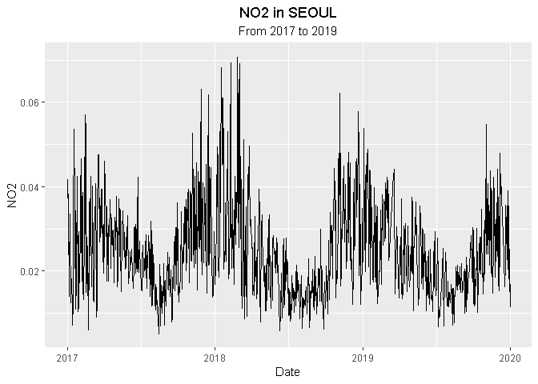
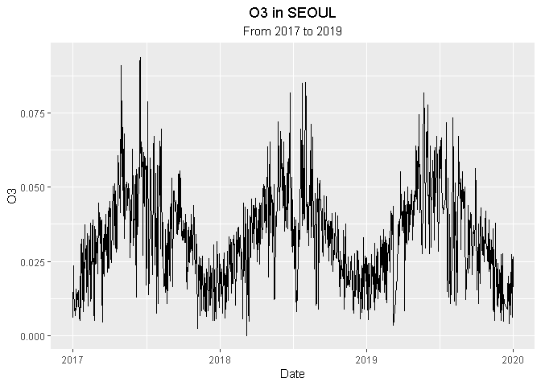
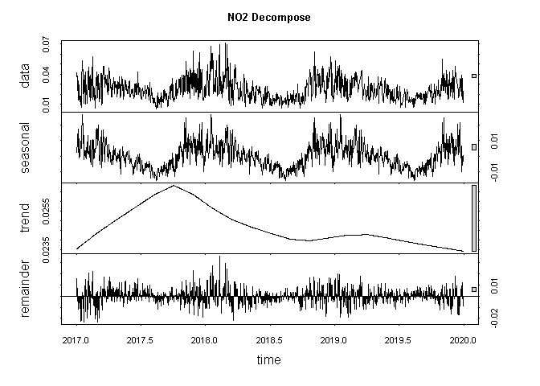
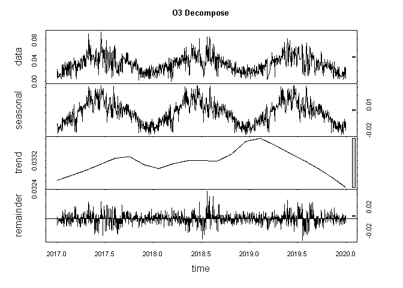
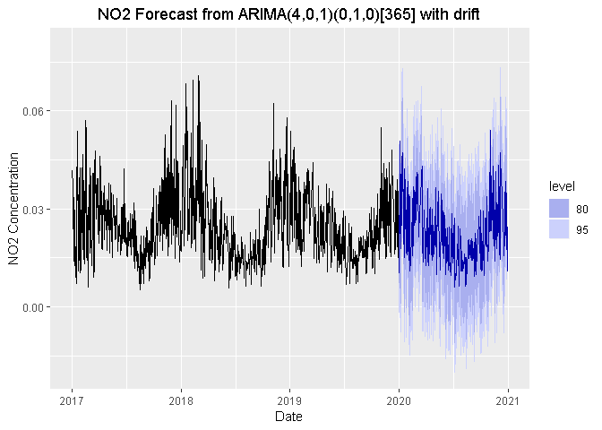
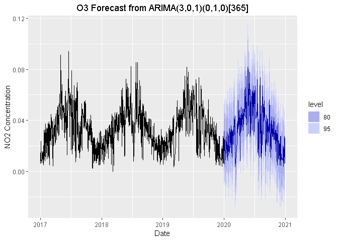
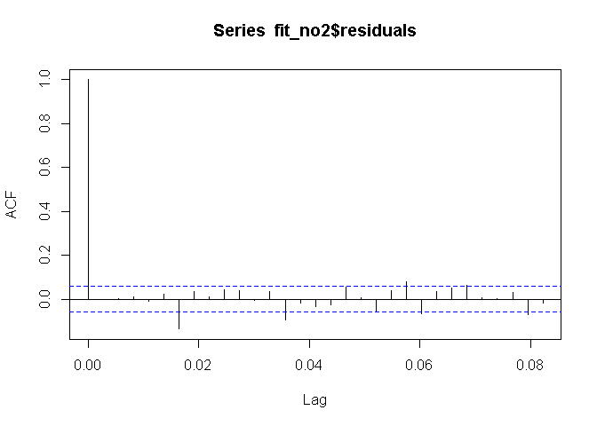
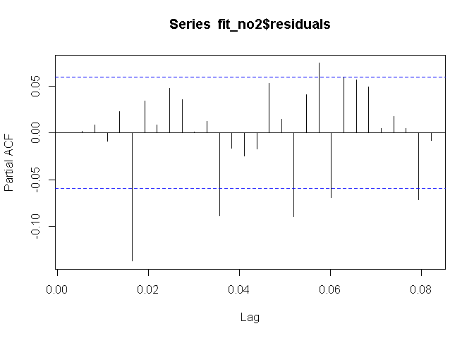
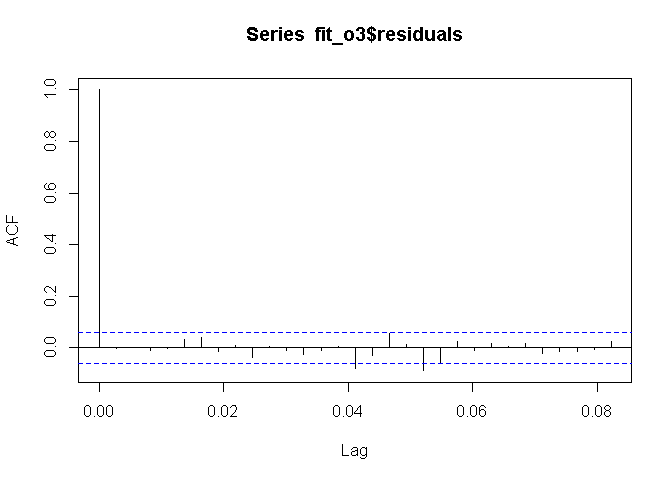
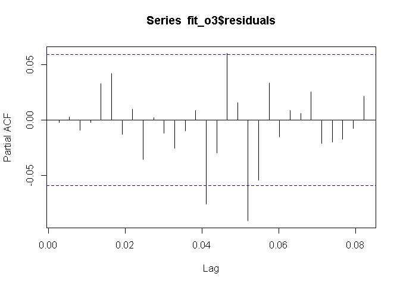

Forecasting Seoul Air Polution using ARIMA Model
================
Kandu Jiwandono
14 April 2020

  - [Introduction](#introduction)
  - [Get Started](#get-started)
      - [Get Library loaded](#get-library-loaded)
      - [Import Datasets](#import-datasets)
      - [Getting to know your data](#getting-to-know-your-data)
  - [Data Cleaning](#data-cleaning)
      - [Identifying the problem](#identifying-the-problem)
      - [Selecting Parameters and
        station](#selecting-parameters-and-station)
      - [Renaming Columns](#renaming-columns)
      - [Filling out skipped date](#filling-out-skipped-date)
      - [Replacing negative value](#replacing-negative-value)
      - [Reshaping Data](#reshaping-data)
      - [Imputing missing value](#imputing-missing-value)
  - [Fitting ARIMA Model](#fitting-arima-model)
      - [Examine your data](#examine-your-data)
      - [Decompose the Data](#decompose-the-data)
      - [Dealing with seasonal
        component](#dealing-with-seasonal-component)
      - [Detecting Stationarity](#detecting-stationarity)
      - [Fitting ARIMA Model](#fitting-arima-model-1)
      - [Model Accuracy](#model-accuracy)

# Introduction

The goal of this Rmd is to calculate and predict air pollution level of
O<sub>3</sub> and NO<sub>2</sub> using ARIMA method at Seoul, South
Korea. The datasets was obtained from
[kaggle.com](https://www.kaggle.com/bappekim/air-pollution-in-seoul).
Thanks to Seoul City, Seoul Open Data Plaza, and Air Quality Analysis
Center for providing data.

# Get Started

## Get Library loaded

first thing first, load several library to R. `readr` is required to
importing the datasets into R.`tidyverse` is required to tidying the
data. `tseries` is required to calculate the ARIMA model. `forecast` is
required to make prediction. And also load `ggplot2` to do some data
visualization.

``` r
library(readr)
library(tidyverse)
library(tseries)
library(forecast)
library(ggplot2)
```

## Import Datasets

Next, after we load all of the required R library, we load the Seoul Air
Polution datasets into R by using `read_csv` command. We store the
datasets into `df_seoul_air_pollution`

``` r
df_seoul_air_pollution <- read_csv("datasets/Measurement_summary.csv")
```

## Getting to know your data

The very first thing after we imported the data is to know our own
datasets. To accomplish that simply just run `glimpse` from `dplyr`
packages at R to inspect the datasets.

``` r
glimpse(df_seoul_air_pollution)
```

    ## Observations: 647,511
    ## Variables: 11
    ## $ `Measurement date` <dttm> 2017-01-01 00:00:00, 2017-01-01 01:00:00, 2017-...
    ## $ `Station code`     <int> 101, 101, 101, 101, 101, 101, 101, 101, 101, 101...
    ## $ Address            <chr> "19, Jong-ro 35ga-gil, Jongno-gu, Seoul, Republi...
    ## $ Latitude           <dbl> 37.57202, 37.57202, 37.57202, 37.57202, 37.57202...
    ## $ Longitude          <dbl> 127.005, 127.005, 127.005, 127.005, 127.005, 127...
    ## $ SO2                <dbl> 0.004, 0.004, 0.004, 0.004, 0.003, 0.003, 0.003,...
    ## $ NO2                <dbl> 0.059, 0.058, 0.056, 0.056, 0.051, 0.046, 0.049,...
    ## $ O3                 <dbl> 0.002, 0.002, 0.002, 0.002, 0.002, 0.002, 0.002,...
    ## $ CO                 <dbl> 1.2, 1.2, 1.2, 1.2, 1.2, 1.1, 1.1, 1.0, 1.1, 1.1...
    ## $ PM10               <dbl> 73, 71, 70, 70, 69, 70, 66, 71, 72, 74, 76, 83, ...
    ## $ PM2.5              <dbl> 57, 59, 59, 58, 61, 61, 57, 60, 60, 63, 68, 74, ...

and also we can view 5 first entry and 5 last entry of the data to get a
better look of it.

``` r
head(df_seoul_air_pollution)
```

    ## # A tibble: 6 x 11
    ##   `Measurement date`  `Station code` Address Latitude Longitude   SO2   NO2
    ##   <dttm>                       <int> <chr>      <dbl>     <dbl> <dbl> <dbl>
    ## 1 2017-01-01 00:00:00            101 19, Jo~     37.6      127. 0.004 0.059
    ## 2 2017-01-01 01:00:00            101 19, Jo~     37.6      127. 0.004 0.058
    ## 3 2017-01-01 02:00:00            101 19, Jo~     37.6      127. 0.004 0.056
    ## 4 2017-01-01 03:00:00            101 19, Jo~     37.6      127. 0.004 0.056
    ## 5 2017-01-01 04:00:00            101 19, Jo~     37.6      127. 0.003 0.051
    ## 6 2017-01-01 05:00:00            101 19, Jo~     37.6      127. 0.003 0.046
    ## # ... with 4 more variables: O3 <dbl>, CO <dbl>, PM10 <dbl>, PM2.5 <dbl>

``` r
tail(df_seoul_air_pollution)
```

    ## # A tibble: 6 x 11
    ##   `Measurement date`  `Station code` Address Latitude Longitude   SO2   NO2
    ##   <dttm>                       <int> <chr>      <dbl>     <dbl> <dbl> <dbl>
    ## 1 2019-12-31 18:00:00            125 59, Gu~     37.5      127. 0.003 0.035
    ## 2 2019-12-31 19:00:00            125 59, Gu~     37.5      127. 0.003 0.028
    ## 3 2019-12-31 20:00:00            125 59, Gu~     37.5      127. 0.003 0.025
    ## 4 2019-12-31 21:00:00            125 59, Gu~     37.5      127. 0.003 0.023
    ## 5 2019-12-31 22:00:00            125 59, Gu~     37.5      127. 0.003 0.04 
    ## 6 2019-12-31 23:00:00            125 59, Gu~     37.5      127. 0.003 0.037
    ## # ... with 4 more variables: O3 <dbl>, CO <dbl>, PM10 <dbl>, PM2.5 <dbl>

From the results above, we can conclude that 11 columns and 647,511
rows. The columns does not only contain pollutant data but also contain
measurement date, and station detail location (address, code,
coordinate). The pollutant data consist of SO<sub>2</sub>,
NO<sub>2</sub>, O<sub>3</sub>, CO, PM<sub>10</sub>, and
PM<sub>2.5</sub>. We also knew that the data is an hourly average data
of several polutant start from 2017-01-01 until 2019-12-31.  
We can also see the summary of our data by running `summary` and we also
check total missing data from each row.

``` r
summary(df_seoul_air_pollution)
```

    ##  Measurement date               Station code   Address             Latitude    
    ##  Min.   :2017-01-01 00:00:00   Min.   :101   Length:647511      Min.   :37.45  
    ##  1st Qu.:2017-09-27 19:00:00   1st Qu.:107   Class :character   1st Qu.:37.52  
    ##  Median :2018-06-24 14:00:00   Median :113   Mode  :character   Median :37.54  
    ##  Mean   :2018-06-27 21:39:49   Mean   :113                      Mean   :37.55  
    ##  3rd Qu.:2019-03-30 15:30:00   3rd Qu.:119                      3rd Qu.:37.58  
    ##  Max.   :2019-12-31 23:00:00   Max.   :125                      Max.   :37.66  
    ##    Longitude          SO2                 NO2                 O3          
    ##  Min.   :126.8   Min.   :-1.000000   Min.   :-1.00000   Min.   :-1.00000  
    ##  1st Qu.:126.9   1st Qu.: 0.003000   1st Qu.: 0.01600   1st Qu.: 0.00800  
    ##  Median :127.0   Median : 0.004000   Median : 0.02500   Median : 0.02100  
    ##  Mean   :127.0   Mean   :-0.001795   Mean   : 0.02252   Mean   : 0.01798  
    ##  3rd Qu.:127.0   3rd Qu.: 0.005000   3rd Qu.: 0.03800   3rd Qu.: 0.03400  
    ##  Max.   :127.1   Max.   : 3.736000   Max.   :38.44500   Max.   :33.60000  
    ##        CO               PM10             PM2.5        
    ##  Min.   :-1.0000   Min.   :  -1.00   Min.   :  -1.00  
    ##  1st Qu.: 0.3000   1st Qu.:  22.00   1st Qu.:  11.00  
    ##  Median : 0.5000   Median :  35.00   Median :  19.00  
    ##  Mean   : 0.5092   Mean   :  43.71   Mean   :  25.41  
    ##  3rd Qu.: 0.6000   3rd Qu.:  53.00   3rd Qu.:  31.00  
    ##  Max.   :71.7000   Max.   :3586.00   Max.   :6256.00

``` r
# Checking missing data
colSums(is.na(df_seoul_air_pollution))
```

    ## Measurement date     Station code          Address         Latitude 
    ##                0                0                0                0 
    ##        Longitude              SO2              NO2               O3 
    ##                0                0                0                0 
    ##               CO             PM10            PM2.5 
    ##                0                0                0

the results shows that the datasets does not contain any missing data.
it means we don’t have to do some missing data imputation to the data.
Unfortunately we have an incorrect data. There is no way that an
concentration value is negative so we are going to fix this data and
replace it with other data.

# Data Cleaning

## Identifying the problem

Before conducting the data cleaning process, we need to know why the
data needs to clean up. As mention before, the default datasets does not
contain a single missing data. Is it true? if we take a look again at
the summary of the datasets, we know that there are a negative number in
all pollutant concentration. Negative number in concentration are not
valid. So, either we change the number with other number such as, mean,
median, etc Or we can simply change them into `NA` or missing value.  
Second, there are several location prior to the data. it means the
pollutant data contain several number of station. in this analysis we
only use just 1 station which is **`Station Code` 104**.  
Third, the goal of this RMD is to make a time series model and
prediction of O<sub>3</sub> and NO<sub>2</sub>. So we have to filter out
other variable that we dont need. We only need `O3`, `NO2` and
`Measurement Date` data from the datasets and also maybe renaming the
`Measurement Date` column so it does contain any space character in its
name.  
Fourth, another problem in this data sets is skipped measurement date.
It means that several dates or hour had been skipped for unknown reason.
for example, let’s take a look at the datasets from **2019-03-11** to
**2019-03-20**

``` r
df_seoul_air_pollution %>% 
  filter(`Measurement date`<= as.Date("2019-03-20"), `Measurement date` >= as.Date("2019-03-11"),
         `Station code` == 104)
```

    ## # A tibble: 47 x 11
    ##    `Measurement date`  `Station code` Address Latitude Longitude   SO2   NO2
    ##    <dttm>                       <int> <chr>      <dbl>     <dbl> <dbl> <dbl>
    ##  1 2019-03-11 05:00:00            104 215, J~     37.6      127. 0.004 0.035
    ##  2 2019-03-11 06:00:00            104 215, J~     37.6      127. 0.005 0.056
    ##  3 2019-03-11 07:00:00            104 215, J~     37.6      127. 0.005 0.058
    ##  4 2019-03-11 09:00:00            104 215, J~     37.6      127. 0.006 0.064
    ##  5 2019-03-18 06:00:00            104 215, J~     37.6      127. 0.004 0.04 
    ##  6 2019-03-18 07:00:00            104 215, J~     37.6      127. 0.004 0.049
    ##  7 2019-03-18 08:00:00            104 215, J~     37.6      127. 0.005 0.048
    ##  8 2019-03-18 09:00:00            104 215, J~     37.6      127. 0.005 0.044
    ##  9 2019-03-18 10:00:00            104 215, J~     37.6      127. 0.005 0.046
    ## 10 2019-03-18 11:00:00            104 215, J~     37.6      127. 0.004 0.041
    ## # ... with 37 more rows, and 4 more variables: O3 <dbl>, CO <dbl>, PM10 <dbl>,
    ## #   PM2.5 <dbl>

From the table above we can see that at 11 March 2019 the data only
available from 05.00 to 09.00, and there are no data inputed 12 March
2019 to 17 March 2019. Let’s solve the problem from the easier one
first.

## Selecting Parameters and station

The goal of this RMD is to forecast O<sub>3</sub> and NO<sub>2</sub>
concentration in the future using ARIMA Method therefore, we select only
the required columns (which are O<sub>3</sub>, NO<sub>2</sub>, and
Measurement date) to make our dataframe clean and tidy. We dont really
need any of station detail such as coordinate, address, code, etc
because we want to make a time series model.

``` r
# check the unique value of station code
df_seoul_air_pollution %>% 
  distinct(`Station code`)
```

    ## # A tibble: 25 x 1
    ##    `Station code`
    ##             <int>
    ##  1            101
    ##  2            102
    ##  3            103
    ##  4            104
    ##  5            105
    ##  6            106
    ##  7            107
    ##  8            108
    ##  9            109
    ## 10            110
    ## # ... with 15 more rows

``` r
# filtering station code and selecting parameters
df_o3_no2 <- df_seoul_air_pollution %>% 
  filter(`Station code` == 104) %>% 
  select(`Measurement date`, NO2, O3)
```

we store the filtered columns to `df_o3_no2`

## Renaming Columns

Lets check the columns name on `df_o3_no2` by running `names` in R

``` r
# checking names of columns
names(df_o3_no2)
```

    ## [1] "Measurement date" "NO2"              "O3"

So, the data consists of 3 columns just as we selected before, and the
name of the columns is measurement date, NO2, and O3. We change the
columns name to make it easier to spell. Change the measurement date
column into date column by running `rename` in R and store it again into
`df_o3_no2`

``` r
#renaming columns
df_o3_no2 <- df_o3_no2 %>% 
  rename(Date = `Measurement date`)

#check if the column name already changed
names(df_o3_no2)
```

    ## [1] "Date" "NO2"  "O3"

## Filling out skipped date

As mentioned before, skipped date occurs several times in datasets. The
skipped date must be filled, in this case the value will be NA. Filling
skipped date data could be done by making a new datasets containing a
full series of date, filter it out by the original datet data, and then
merged 2 data sets into 1.

``` r
# creating a new datasets contain full date from 2017-01-01 to 2019-12-31
df_full_date <- data.frame(Date = seq(as.POSIXct("2017-01-01 00:00:00"), as.POSIXct("2019-12-31 23:00:00"), by= "hour"),
                           NO2 = NA, O3 = NA)

# filtering the date
df_full_date <- df_full_date %>% 
  filter(!Date %in% df_o3_no2$Date)

# join 2 datasets into a new df
df_o3_no2 <- df_full_date %>% 
  full_join(df_o3_no2) %>% 
  filter(Date >= as.Date("2017-01-01")) %>% 
  arrange(Date)

# crosscheck if the jobs done
df_o3_no2 %>% 
  filter(Date >= as.Date("2019-03-11"), Date <= as.Date("2019-03-20"))
```

    ##                    Date   NO2    O3
    ## 1   2019-03-11 00:00:00    NA    NA
    ## 2   2019-03-11 01:00:00    NA    NA
    ## 3   2019-03-11 02:00:00    NA    NA
    ## 4   2019-03-11 03:00:00    NA    NA
    ## 5   2019-03-11 04:00:00    NA    NA
    ## 6   2019-03-11 05:00:00 0.035 0.017
    ## 7   2019-03-11 06:00:00 0.056 0.005
    ## 8   2019-03-11 07:00:00 0.058 0.004
    ## 9   2019-03-11 08:00:00    NA    NA
    ## 10  2019-03-11 09:00:00 0.064 0.007
    ## 11  2019-03-11 10:00:00    NA    NA
    ## 12  2019-03-11 11:00:00    NA    NA
    ## 13  2019-03-11 12:00:00    NA    NA
    ## 14  2019-03-11 13:00:00    NA    NA
    ## 15  2019-03-11 14:00:00    NA    NA
    ## 16  2019-03-11 15:00:00    NA    NA
    ## 17  2019-03-11 16:00:00    NA    NA
    ## 18  2019-03-11 17:00:00    NA    NA
    ## 19  2019-03-11 18:00:00    NA    NA
    ## 20  2019-03-11 19:00:00    NA    NA
    ## 21  2019-03-11 20:00:00    NA    NA
    ## 22  2019-03-11 21:00:00    NA    NA
    ## 23  2019-03-11 22:00:00    NA    NA
    ## 24  2019-03-11 23:00:00    NA    NA
    ## 25  2019-03-12 00:00:00    NA    NA
    ## 26  2019-03-12 01:00:00    NA    NA
    ## 27  2019-03-12 02:00:00    NA    NA
    ## 28  2019-03-12 03:00:00    NA    NA
    ## 29  2019-03-12 04:00:00    NA    NA
    ## 30  2019-03-12 05:00:00    NA    NA
    ## 31  2019-03-12 06:00:00    NA    NA
    ## 32  2019-03-12 07:00:00    NA    NA
    ## 33  2019-03-12 08:00:00    NA    NA
    ## 34  2019-03-12 09:00:00    NA    NA
    ## 35  2019-03-12 10:00:00    NA    NA
    ## 36  2019-03-12 11:00:00    NA    NA
    ## 37  2019-03-12 12:00:00    NA    NA
    ## 38  2019-03-12 13:00:00    NA    NA
    ## 39  2019-03-12 14:00:00    NA    NA
    ## 40  2019-03-12 15:00:00    NA    NA
    ## 41  2019-03-12 16:00:00    NA    NA
    ## 42  2019-03-12 17:00:00    NA    NA
    ## 43  2019-03-12 18:00:00    NA    NA
    ## 44  2019-03-12 19:00:00    NA    NA
    ## 45  2019-03-12 20:00:00    NA    NA
    ## 46  2019-03-12 21:00:00    NA    NA
    ## 47  2019-03-12 22:00:00    NA    NA
    ## 48  2019-03-12 23:00:00    NA    NA
    ## 49  2019-03-13 00:00:00    NA    NA
    ## 50  2019-03-13 01:00:00    NA    NA
    ## 51  2019-03-13 02:00:00    NA    NA
    ## 52  2019-03-13 03:00:00    NA    NA
    ## 53  2019-03-13 04:00:00    NA    NA
    ## 54  2019-03-13 05:00:00    NA    NA
    ## 55  2019-03-13 06:00:00    NA    NA
    ## 56  2019-03-13 07:00:00    NA    NA
    ## 57  2019-03-13 08:00:00    NA    NA
    ## 58  2019-03-13 09:00:00    NA    NA
    ## 59  2019-03-13 10:00:00    NA    NA
    ## 60  2019-03-13 11:00:00    NA    NA
    ## 61  2019-03-13 12:00:00    NA    NA
    ## 62  2019-03-13 13:00:00    NA    NA
    ## 63  2019-03-13 14:00:00    NA    NA
    ## 64  2019-03-13 15:00:00    NA    NA
    ## 65  2019-03-13 16:00:00    NA    NA
    ## 66  2019-03-13 17:00:00    NA    NA
    ## 67  2019-03-13 18:00:00    NA    NA
    ## 68  2019-03-13 19:00:00    NA    NA
    ## 69  2019-03-13 20:00:00    NA    NA
    ## 70  2019-03-13 21:00:00    NA    NA
    ## 71  2019-03-13 22:00:00    NA    NA
    ## 72  2019-03-13 23:00:00    NA    NA
    ## 73  2019-03-14 00:00:00    NA    NA
    ## 74  2019-03-14 01:00:00    NA    NA
    ## 75  2019-03-14 02:00:00    NA    NA
    ## 76  2019-03-14 03:00:00    NA    NA
    ## 77  2019-03-14 04:00:00    NA    NA
    ## 78  2019-03-14 05:00:00    NA    NA
    ## 79  2019-03-14 06:00:00    NA    NA
    ## 80  2019-03-14 07:00:00    NA    NA
    ## 81  2019-03-14 08:00:00    NA    NA
    ## 82  2019-03-14 09:00:00    NA    NA
    ## 83  2019-03-14 10:00:00    NA    NA
    ## 84  2019-03-14 11:00:00    NA    NA
    ## 85  2019-03-14 12:00:00    NA    NA
    ## 86  2019-03-14 13:00:00    NA    NA
    ## 87  2019-03-14 14:00:00    NA    NA
    ## 88  2019-03-14 15:00:00    NA    NA
    ## 89  2019-03-14 16:00:00    NA    NA
    ## 90  2019-03-14 17:00:00    NA    NA
    ## 91  2019-03-14 18:00:00    NA    NA
    ## 92  2019-03-14 19:00:00    NA    NA
    ## 93  2019-03-14 20:00:00    NA    NA
    ## 94  2019-03-14 21:00:00    NA    NA
    ## 95  2019-03-14 22:00:00    NA    NA
    ## 96  2019-03-14 23:00:00    NA    NA
    ## 97  2019-03-15 00:00:00    NA    NA
    ## 98  2019-03-15 01:00:00    NA    NA
    ## 99  2019-03-15 02:00:00    NA    NA
    ## 100 2019-03-15 03:00:00    NA    NA
    ## 101 2019-03-15 04:00:00    NA    NA
    ## 102 2019-03-15 05:00:00    NA    NA
    ## 103 2019-03-15 06:00:00    NA    NA
    ## 104 2019-03-15 07:00:00    NA    NA
    ## 105 2019-03-15 08:00:00    NA    NA
    ## 106 2019-03-15 09:00:00    NA    NA
    ## 107 2019-03-15 10:00:00    NA    NA
    ## 108 2019-03-15 11:00:00    NA    NA
    ## 109 2019-03-15 12:00:00    NA    NA
    ## 110 2019-03-15 13:00:00    NA    NA
    ## 111 2019-03-15 14:00:00    NA    NA
    ## 112 2019-03-15 15:00:00    NA    NA
    ## 113 2019-03-15 16:00:00    NA    NA
    ## 114 2019-03-15 17:00:00    NA    NA
    ## 115 2019-03-15 18:00:00    NA    NA
    ## 116 2019-03-15 19:00:00    NA    NA
    ## 117 2019-03-15 20:00:00    NA    NA
    ## 118 2019-03-15 21:00:00    NA    NA
    ## 119 2019-03-15 22:00:00    NA    NA
    ## 120 2019-03-15 23:00:00    NA    NA
    ## 121 2019-03-16 00:00:00    NA    NA
    ## 122 2019-03-16 01:00:00    NA    NA
    ## 123 2019-03-16 02:00:00    NA    NA
    ## 124 2019-03-16 03:00:00    NA    NA
    ## 125 2019-03-16 04:00:00    NA    NA
    ## 126 2019-03-16 05:00:00    NA    NA
    ## 127 2019-03-16 06:00:00    NA    NA
    ## 128 2019-03-16 07:00:00    NA    NA
    ## 129 2019-03-16 08:00:00    NA    NA
    ## 130 2019-03-16 09:00:00    NA    NA
    ## 131 2019-03-16 10:00:00    NA    NA
    ## 132 2019-03-16 11:00:00    NA    NA
    ## 133 2019-03-16 12:00:00    NA    NA
    ## 134 2019-03-16 13:00:00    NA    NA
    ## 135 2019-03-16 14:00:00    NA    NA
    ## 136 2019-03-16 15:00:00    NA    NA
    ## 137 2019-03-16 16:00:00    NA    NA
    ## 138 2019-03-16 17:00:00    NA    NA
    ## 139 2019-03-16 18:00:00    NA    NA
    ## 140 2019-03-16 19:00:00    NA    NA
    ## 141 2019-03-16 20:00:00    NA    NA
    ## 142 2019-03-16 21:00:00    NA    NA
    ## 143 2019-03-16 22:00:00    NA    NA
    ## 144 2019-03-16 23:00:00    NA    NA
    ## 145 2019-03-17 00:00:00    NA    NA
    ## 146 2019-03-17 01:00:00    NA    NA
    ## 147 2019-03-17 02:00:00    NA    NA
    ## 148 2019-03-17 03:00:00    NA    NA
    ## 149 2019-03-17 04:00:00    NA    NA
    ## 150 2019-03-17 05:00:00    NA    NA
    ## 151 2019-03-17 06:00:00    NA    NA
    ## 152 2019-03-17 07:00:00    NA    NA
    ## 153 2019-03-17 08:00:00    NA    NA
    ## 154 2019-03-17 09:00:00    NA    NA
    ## 155 2019-03-17 10:00:00    NA    NA
    ## 156 2019-03-17 11:00:00    NA    NA
    ## 157 2019-03-17 12:00:00    NA    NA
    ## 158 2019-03-17 13:00:00    NA    NA
    ## 159 2019-03-17 14:00:00    NA    NA
    ## 160 2019-03-17 15:00:00    NA    NA
    ## 161 2019-03-17 16:00:00    NA    NA
    ## 162 2019-03-17 17:00:00    NA    NA
    ## 163 2019-03-17 18:00:00    NA    NA
    ## 164 2019-03-17 19:00:00    NA    NA
    ## 165 2019-03-17 20:00:00    NA    NA
    ## 166 2019-03-17 21:00:00    NA    NA
    ## 167 2019-03-17 22:00:00    NA    NA
    ## 168 2019-03-17 23:00:00    NA    NA
    ## 169 2019-03-18 00:00:00    NA    NA
    ## 170 2019-03-18 01:00:00    NA    NA
    ## 171 2019-03-18 02:00:00    NA    NA
    ## 172 2019-03-18 03:00:00    NA    NA
    ## 173 2019-03-18 04:00:00    NA    NA
    ## 174 2019-03-18 05:00:00    NA    NA
    ## 175 2019-03-18 06:00:00 0.040 0.007
    ## 176 2019-03-18 07:00:00 0.049 0.005
    ## 177 2019-03-18 08:00:00 0.048 0.007
    ## 178 2019-03-18 09:00:00 0.044 0.012
    ## 179 2019-03-18 10:00:00 0.046 0.013
    ## 180 2019-03-18 11:00:00 0.041 0.019
    ## 181 2019-03-18 12:00:00 0.038 0.025
    ## 182 2019-03-18 13:00:00 0.036 0.029
    ## 183 2019-03-18 14:00:00 0.042 0.029
    ## 184 2019-03-18 15:00:00 0.043 0.031
    ## 185 2019-03-18 16:00:00 0.038 0.032
    ## 186 2019-03-18 17:00:00 0.035 0.038
    ## 187 2019-03-18 18:00:00 0.034 0.043
    ## 188 2019-03-18 19:00:00 0.042 0.025
    ## 189 2019-03-18 20:00:00 0.054 0.011
    ## 190 2019-03-18 21:00:00 0.051 0.006
    ## 191 2019-03-18 22:00:00 0.038 0.015
    ## 192 2019-03-18 23:00:00 0.036 0.016
    ## 193 2019-03-19 00:00:00 0.040 0.015
    ## 194 2019-03-19 01:00:00 0.044 0.010
    ## 195 2019-03-19 02:00:00 0.041 0.009
    ## 196 2019-03-19 03:00:00 0.038 0.010
    ## 197 2019-03-19 04:00:00 0.047 0.004
    ## 198 2019-03-19 05:00:00 0.048 0.004
    ## 199 2019-03-19 06:00:00 0.055 0.003
    ## 200 2019-03-19 07:00:00 0.063 0.004
    ## 201 2019-03-19 08:00:00 0.061 0.006
    ## 202 2019-03-19 09:00:00 0.045 0.015
    ## 203 2019-03-19 10:00:00 0.042 0.020
    ## 204 2019-03-19 11:00:00 0.000 0.000
    ## 205 2019-03-19 12:00:00 0.050 0.022
    ## 206 2019-03-19 13:00:00 0.038 0.039
    ## 207 2019-03-19 14:00:00 0.035 0.046
    ## 208 2019-03-19 15:00:00 0.038 0.045
    ## 209 2019-03-19 16:00:00 0.042 0.039
    ## 210 2019-03-19 17:00:00 0.042 0.040
    ## 211 2019-03-19 18:00:00 0.034 0.043
    ## 212 2019-03-19 19:00:00 0.043 0.031
    ## 213 2019-03-19 20:00:00 0.063 0.005
    ## 214 2019-03-19 21:00:00 0.058 0.005
    ## 215 2019-03-19 22:00:00 0.048 0.009
    ## 216 2019-03-19 23:00:00 0.043 0.011
    ## 217 2019-03-20 00:00:00 0.038 0.014

**JOBS DONE\!\!**

## Replacing negative value

as we all know, the concentration value of a pollutant is not a negative
number. there are several observation which has negative number, so
either we replace it with any other number or we just simply drop the
observation value. First, lets take a look at the negative number on the
data, and then replace it with `NA`

``` r
# splitting datasets into two
df_no2 <- df_o3_no2 %>% 
  select(Date, NO2)

df_o3 <- df_o3_no2 %>% 
  select(Date, O3)

# filtering negative data
## NO2
df_no2 %>% 
  filter(NO2 < 0)

## O3
df_o3 %>% 
  filter(O3 < 0)

## Both of O3 and NO2
df_o3_no2 %>% 
  filter(O3<0, NO2 <0)

# replacing negative number with NA
## NO2
df_no2 <- df_no2  %>%  
  mutate(Date = as.Date(Date, format = "%Y-%m-%d"),
         NO2 = replace(NO2, which(NO2<0), NA))

## O3
df_o3 <- df_o3 %>% 
  mutate(Date = as.Date(Date, format = "%Y-%m-%d"),
         O3 = replace(O3, which(O3<0), NA))
```

The replacing process should be done by now, and now we have missing
value to take care.

## Reshaping Data

Before we go into further analysis, we must reshape the data and make
the data as tidy as possible. First, what we need is a daily average
data not an hourly average data, so we calculate the daily average data
by averaging 24 hour data for NO<sub>2</sub>. Second, what we need for
O<sub>3</sub> is 8 hour average daily data from 08.00 to 16.00. It is
because O<sub>3</sub> is formed by fotochemical reaction with the help
of sun light. So, we need to calculate a new data for both of pollutant.

### NO<sub>2</sub>

The calculation is not a simple 24 average. First, we need to check if
the total available data of the day are 80% or more. if the data is
sufficient then we can count the mean by ignoring the missing data. if
the data availability below 80% we should drop the data and replace it
with `NA`.

``` r
#24 hour average for no2

i = 1
df_ins = df_no2
inscol = 2
mulai = 1
akhir = 24
jml_data = 24
n80 = as.integer(0.8*jml_data)
N = nrow(df_ins)
nhari= N/jml_data
df_no2_baru <- data.frame(Date = seq(as.Date("2017-01-01", format = "%Y-%m-%d"), as.Date("2019-12-31", format = "%Y-%m-%d"), by = "day"), NO2 =1) 

for(i in 1:nhari){
  if(sum(!is.na(df_ins[mulai:akhir,inscol]))>=n80){ 
    df_no2_baru[i,2]<-colMeans(as.data.frame(df_ins[mulai:akhir,inscol]),na.rm = TRUE)
  }
  else {df_no2_baru[i,2]=NA}
  
  mulai<-mulai+jml_data
  akhir<-akhir+jml_data
}

## checking number of NA
df_no2_baru %>% filter(is.na(NO2))
```

    ##          Date NO2
    ## 1  2017-05-15  NA
    ## 2  2017-05-16  NA
    ## 3  2017-05-17  NA
    ## 4  2019-03-09  NA
    ## 5  2019-03-10  NA
    ## 6  2019-03-11  NA
    ## 7  2019-03-12  NA
    ## 8  2019-03-13  NA
    ## 9  2019-03-14  NA
    ## 10 2019-03-15  NA
    ## 11 2019-03-16  NA
    ## 12 2019-03-17  NA
    ## 13 2019-03-18  NA
    ## 14 2019-05-15  NA
    ## 15 2019-05-16  NA
    ## 16 2019-05-17  NA
    ## 17 2019-05-18  NA
    ## 18 2019-05-22  NA
    ## 19 2019-07-03  NA
    ## 20 2019-07-04  NA
    ## 21 2019-07-11  NA
    ## 22 2019-07-12  NA
    ## 23 2019-07-13  NA
    ## 24 2019-07-14  NA
    ## 25 2019-07-15  NA
    ## 26 2019-07-16  NA
    ## 27 2019-08-21  NA
    ## 28 2019-08-22  NA
    ## 29 2019-09-07  NA
    ## 30 2019-09-08  NA
    ## 31 2019-09-09  NA
    ## 32 2019-09-20  NA
    ## 33 2019-09-21  NA
    ## 34 2019-09-22  NA
    ## 35 2019-09-23  NA
    ## 36 2019-12-01  NA
    ## 37 2019-12-10  NA
    ## 38 2019-12-11  NA
    ## 39 2019-12-12  NA
    ## 40 2019-12-13  NA
    ## 41 2019-12-14  NA
    ## 42 2019-12-15  NA
    ## 43 2019-12-16  NA

``` r
rm(i, df_ins, inscol, mulai, akhir, jml_data, n80, N, nhari)
```

Store the calculation result as `df_no2_baru`

### O<sub>3</sub>

Like NO<sub>2</sub>, The calculation for reshaping O<sub>3</sub> data is
not a simple 8 hours mean. At first, the data will be filtered only from
08.00 to 16.00 per day. Second, check the availability of the data
perday. If the data availability more than 80% then calculate the mean,
else we drop the data and replace it with `NA`.

``` r
# Daily 8 hours average for O3
i = 1
df_ins = df_o3
inscol = 2
mulai = 8
akhir = 16
jml_data = 24
n80 = as.integer(0.8*9)
N = nrow(df_ins)
nhari= N/jml_data
df_o3_baru <- data.frame(Date = seq(as.Date("2017-01-01", format = "%Y-%m-%d"), as.Date("2019-12-31", format = "%Y-%m-%d"), by = "day"), O3 =1) 

for(i in 1:nhari){
  if(sum(!is.na(df_ins[mulai:akhir,inscol]))>=n80){ 
    df_o3_baru[i,2]<-colMeans(as.data.frame(df_ins[mulai:akhir,inscol]),na.rm = TRUE)
  }
  else {df_o3_baru[i,2]=NA}
  
  mulai<-mulai+jml_data
  akhir<-akhir+jml_data
}

## checking number of NA
df_o3_baru %>% filter(is.na(O3))
```

    ##          Date O3
    ## 1  2017-05-16 NA
    ## 2  2017-05-17 NA
    ## 3  2019-03-09 NA
    ## 4  2019-03-10 NA
    ## 5  2019-03-11 NA
    ## 6  2019-03-12 NA
    ## 7  2019-03-13 NA
    ## 8  2019-03-14 NA
    ## 9  2019-03-15 NA
    ## 10 2019-03-16 NA
    ## 11 2019-03-17 NA
    ## 12 2019-05-15 NA
    ## 13 2019-05-16 NA
    ## 14 2019-05-17 NA
    ## 15 2019-05-18 NA
    ## 16 2019-05-22 NA
    ## 17 2019-07-04 NA
    ## 18 2019-07-11 NA
    ## 19 2019-07-12 NA
    ## 20 2019-07-13 NA
    ## 21 2019-07-14 NA
    ## 22 2019-07-15 NA
    ## 23 2019-07-16 NA
    ## 24 2019-09-07 NA
    ## 25 2019-09-08 NA
    ## 26 2019-09-21 NA
    ## 27 2019-09-22 NA
    ## 28 2019-09-23 NA
    ## 29 2019-12-10 NA
    ## 30 2019-12-11 NA
    ## 31 2019-12-12 NA
    ## 32 2019-12-13 NA
    ## 33 2019-12-14 NA
    ## 34 2019-12-15 NA
    ## 35 2019-12-16 NA

``` r
rm(i, df_ins, inscol, mulai, akhir, jml_data, n80, N, nhari)
```

Store the calculation result as `df_o3_baru`

## Imputing missing value

We need imputing missing value because if we dont impute it we cannot
calculate the time series model. The imputation method is interpolation.
Interpolation is a type of estimation, a method of constructing new data
points within the range of a discrete set of known data points. For the
time series type data, we just have to run a function called `tsclean`
from `forecast` packages to help us clean the data.

``` r
# Clean NO2
df_no2_baru$NO2 <-  tsclean(df_no2_baru$NO2)

# Clean O3
df_o3_baru$O3 <- tsclean(df_o3_baru$O3)
```

# Fitting ARIMA Model

## Examine your data

A good starting point to making a model is to take a look at your data.
Even we already have the data being cleaned, it does not hurt us to take
a look again at the data in order to check the data compability to the
model.
<!-- --><!-- -->

From the graphic above, looks like both of the data has seasonality
effect. The concentration of NO<sub>2</sub> rises at the end of the year
and decline at the middle of the year. On the contrary, the
concentration of O<sub>3</sub> rises at the middle of the year and
decline at the the end of the year. In Korea, the end of the year means
winter and the middle of the year means summer. So we can conclude that
O<sub>3</sub> Concentration will increase at Summer but decline at
Winter, and NO<sub>2</sub> concentration wikll increase at Winter but
decline at Summer.

## Decompose the Data

The building block of time series data is seasonality, trend, and cycle.
In order to find that, we can decompose the data using `decompose`
function in `tseries` packages in R. Decomposing the data aims to detect
the data behaviour wether seasonality, trend, and cycle are exist or
not. <!-- --> From 4 set
of graphs above, we can conclude that, there are seasonal effect in the
data and also for there are no significant trend for NO2 concentration
data. This information obtained from gray bar at right side of the plot.
The grey bar at the seasonal section is a little bigger than at the data
section. It indicates that the data has seasonal effect on it.

<!-- -->

Again, from the 4 sets of graph above, we can conclude that, there are
seasonal effect and no trend in O3 data.

## Dealing with seasonal component

From the graph before, we can conclude that both of NO<sub>2</sub> and
O<sub>3</sub> has seasonality effect. From the graph above, the season
period of these 2 pollutant approximately are 1 year or 365 days. Before
we calculate the ARIMA model, we should remove the seasonality first.
Removing seasonality can be done by running `seasadj()` in R.

``` r
# Season_adj for NO2
df_no2_ts_adj <- seasadj(no2_stl)

# Season_adj for O3
df_o3_ts_adj <- seasadj(o3_stl)
```

Save the results into new variable called `df_no2_ts_adj` for
NO<sub>2</sub> and `df_o3_ts_adj` for O<sub>3</sub>. The other
alternative that we can approach is by using seasonal ARIMA model or
called SARIMA. This model can handle seasonality that exist in the
series so we don’t have to adjust the series in order to eliminate the
seasonal effect.

## Detecting Stationarity

Fitting an ARIMA model requires a stationary data. A series is said to
be stationary when its mean, variance, and autocovariance are time
invariant. This assumption makes intuitive sense: Since ARIMA uses
previous lags of series to model its behavior, modeling stable series
with consistent properties involves less uncertainty.

The formal test to check wether a series is stationary is Augmented
Dickey-Fuller (ADF). The null hypothesis assumes that the series is non
stationary, The ADF test can be done in R by running `adf.test`

    ## 
    ##  Augmented Dickey-Fuller Test
    ## 
    ## data:  df_no2_ts
    ## Dickey-Fuller = -5.1933, Lag order = 10, p-value = 0.01
    ## alternative hypothesis: stationary

    ## 
    ##  Augmented Dickey-Fuller Test
    ## 
    ## data:  df_o3_ts
    ## Dickey-Fuller = -4.4735, Lag order = 10, p-value = 0.01
    ## alternative hypothesis: stationary

Both of O<sub>3</sub> and NO<sub>2</sub> adf-test results shows they
have p-value of 0.01. From the adf-test result we can conclude that both
of O<sub>3</sub> and NO<sub>2</sub> series are non stationary because
both of them have **p-value \< 0.05**

## Fitting ARIMA Model

Fitting ARIMA model or Seasonal ARIMA Model in R requires a packages
called `forecast`. The `forecast` packages allows user to determine
their own order of ARIMA model by using `arima()` function or we can
automatically select the order by its aic and bic number by running
`auto.arima()` function. In this case, we try to fitting Seasonal ARIMA
model by using `auto.arima` function but forcing the function to fit
only Seasonal ARIMA.

``` r
# Fitting ARIMA model NO2
fit_no2 <- auto.arima(df_no2_ts,stepwise = F, test = "adf", seasonal = TRUE, D= 1,
                      seasonal.test = "ocsb")

# Fitting ARIMA model O3
fit_o3 <- auto.arima(df_o3_ts, stepwise = F, test = "adf", D=1, 
                     seasonal = TRUE, seasonal.test = "ocsb")

summary(fit_no2)
```

    ## Series: df_no2_ts 
    ## ARIMA(4,0,1)(0,1,0)[365] with drift 
    ## 
    ## Coefficients:
    ##          ar1      ar2     ar3      ar4      ma1  drift
    ##       1.4381  -0.5675  0.1860  -0.0687  -0.9619  0e+00
    ## s.e.  0.0505   0.0668  0.0648   0.0384   0.0356  1e-04
    ## 
    ## sigma^2 estimated as 0.0001402:  log likelihood=2205.56
    ## AIC=-4397.12   AICc=-4396.96   BIC=-4364.96
    ## 
    ## Training set error measures:
    ##                         ME        RMSE         MAE       MPE     MAPE      MASE
    ## Training set -4.365497e-05 0.009626671 0.005855093 -7.234223 26.75862 0.5871731
    ##                       ACF1
    ## Training set -3.432465e-05

``` r
summary(fit_o3)
```

    ## Series: df_o3_ts 
    ## ARIMA(3,0,1)(0,1,0)[365] 
    ## 
    ## Coefficients:
    ##          ar1      ar2     ar3      ma1
    ##       0.9886  -0.3056  0.1447  -0.5886
    ## s.e.  0.1084   0.0628  0.0385   0.1053
    ## 
    ## sigma^2 estimated as 0.0002256:  log likelihood=2030.87
    ## AIC=-4051.74   AICc=-4051.66   BIC=-4028.78
    ## 
    ## Training set error measures:
    ##                        ME       RMSE        MAE  MPE MAPE     MASE         ACF1
    ## Training set 4.212693e-05 0.01222976 0.00772116 -Inf  Inf 0.608356 -0.002337009

store the fitted Seasonal ARIMA model in a new variable called `fit_no2`
for NO2 model, and `fit_o3` for O3 model. After we fitted Seasonal ARIMA
model for each pollutant now we can forecast both of pollutant
concentration. Forecasting concentration from fitted model can be done
by running `forecast()`.

``` r
# Forecasting for NO2
no2_forecasted <- forecast(fit_no2, h = 365)

# Forecasting for O3
o3_forecasted <- forecast(fit_o3, h= 365)
```

Store the forecast results to a new variable called `no2_forecasted` and
`o3_forecasted` for each pollutant. Take a look at first 30 days of
forecasted concentration from both pollutant

``` r
# Creating data frame from first 30 days of forecasted data
forecasted <- data.frame(DATE = seq(as.Date("2020-01-01", format = "%Y-%m-%d"), as.Date("2020-01-30", format = "%Y-%m-%d"), by = "day"),
           no2_forecasted = no2_forecasted$mean[1:30],
           O3 = o3_forecasted$mean[1:30])
```

    ##          DATE no2_forecasted          O3
    ## 1  2020-01-01     0.01011683 0.031606903
    ## 2  2020-01-02     0.02380883 0.021000252
    ## 3  2020-01-03     0.03202671 0.011260030
    ## 4  2020-01-04     0.05079580 0.005728655
    ## 5  2020-01-05     0.02241926 0.024914871
    ## 6  2020-01-06     0.02727126 0.017586567
    ## 7  2020-01-07     0.04070597 0.016719370
    ## 8  2020-01-08     0.01789611 0.024597101
    ## 9  2020-01-09     0.03145004 0.009137511
    ## 10 2020-01-10     0.04032151 0.009557450
    ## 11 2020-01-11     0.04610090 0.011425126
    ## 12 2020-01-12     0.04183542 0.016409451
    ## 13 2020-01-13     0.03640146 0.027285779
    ## 14 2020-01-14     0.04709116 0.020163969
    ## 15 2020-01-15     0.02361331 0.022266074
    ## 16 2020-01-16     0.01925983 0.022369732
    ## 17 2020-01-17     0.02990581 0.023030234
    ## 18 2020-01-18     0.04221799 0.011358448
    ## 19 2020-01-19     0.04202971 0.015354191
    ## 20 2020-01-20     0.01513269 0.031128432
    ## 21 2020-01-21     0.03227692 0.008681052
    ## 22 2020-01-22     0.03879576 0.016345281
    ## 23 2020-01-23     0.02831421 0.020898811
    ## 24 2020-01-24     0.02954061 0.015786018
    ## 25 2020-01-25     0.02184998 0.024451288
    ## 26 2020-01-26     0.01640899 0.029339017
    ## 27 2020-01-27     0.02692598 0.017671387
    ## 28 2020-01-28     0.01585928 0.028115032
    ## 29 2020-01-29     0.03445892 0.012447700
    ## 30 2020-01-30     0.03834988 0.018224926

if we plot all of the forecasted results in 365 day, the graph would be
<!-- --><!-- -->

## Model Accuracy

Last, ofcourse we want to know how well our model works. To find out how
well our model works we can just model accuracy as a parameter to
evaluate our fitted model.

``` r
# NO2 model accuracy
accuracy(fit_no2)
```

    ##                         ME        RMSE         MAE       MPE     MAPE      MASE
    ## Training set -4.365497e-05 0.009626671 0.005855093 -7.234223 26.75862 0.5871731
    ##                       ACF1
    ## Training set -3.432465e-05

``` r
# O3 model accuracy
accuracy(fit_o3)
```

    ##                        ME       RMSE        MAE  MPE MAPE     MASE         ACF1
    ## Training set 4.212693e-05 0.01222976 0.00772116 -Inf  Inf 0.608356 -0.002337009

From the results above, we can say that the average percentage error of
the NO<sub>2</sub> model is 26.75% and for O<sub>3</sub> we cant really
tell how much the error. This indicates that something wrong with the
model. First we check the acf and pacf from model residuals

``` r
acf(fit_no2$residuals)
```

<!-- -->

``` r
pacf(fit_no2$residuals)
```

<!-- -->

``` r
acf(fit_o3$residuals)
```

<!-- -->

``` r
pacf(fit_o3$residuals)
```

<!-- --> The ACF and
PACF plot for those 2 models seems awful. There are so many of black
vertical lines crossing the blue striped line. It means that the model
does not meet auto correlation assumption. The model error can also
caused by ARIMA model itself since it cannot handle longer period of
seasonality and multiple seasonality. This problem can be solved by
transforming daily data into weekly or maybe monthly data in order to
shorten the period of seasonality.
