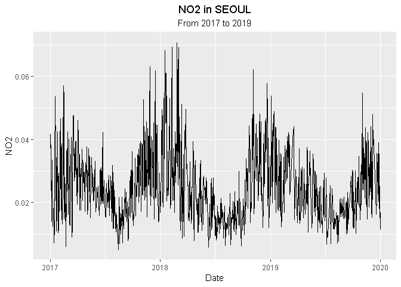
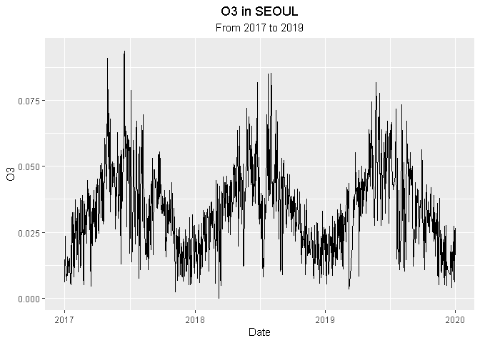
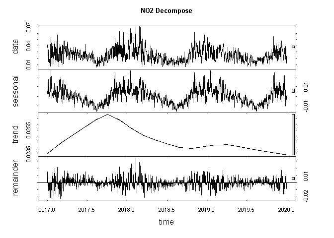
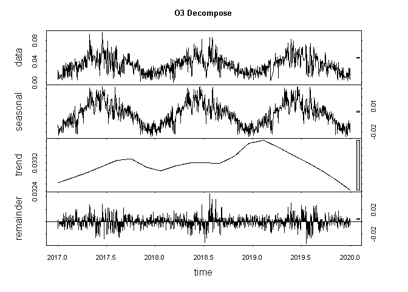
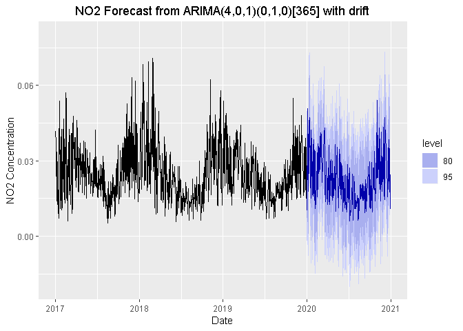
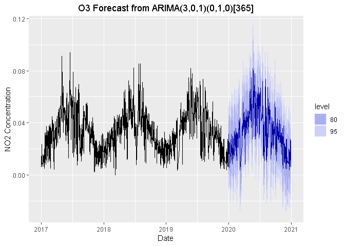
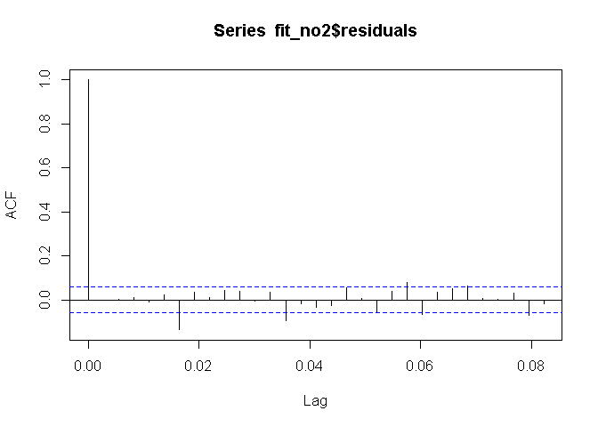
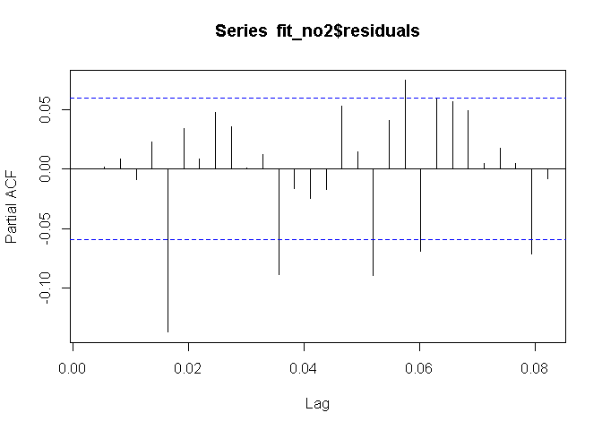
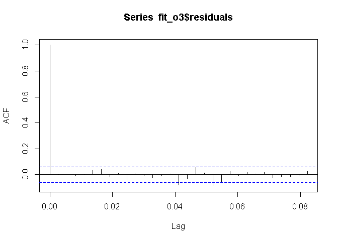
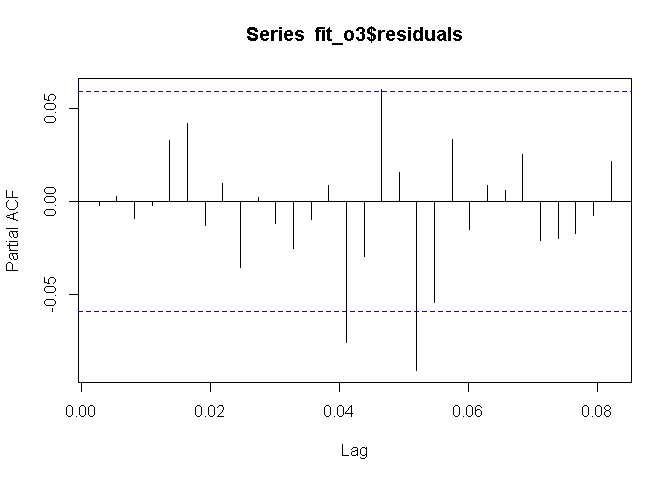

# Introduction


The goal of this Rmd is to calculate and predict air pollution level of O~3~ and NO~2~ using ARIMA method at Seoul, South Korea. The datasets was obtained from [kaggle.com](https://www.kaggle.com/bappekim/air-pollution-in-seoul). Thanks to Seoul City, Seoul Open Data Plaza, and Air Quality Analysis Center for providing data.  
  
  
  
# Get Started
## Get Library loaded

first thing first, load several library to R. `readr` is required to importing the datasets into R.`tidyverse` is required to tidying the data. `tseries` is required to calculate the ARIMA model. `forecast` is required to make prediction. And also load `ggplot2` to do some data visualization.

```r
library(readr)
library(tidyverse)
library(tseries)
library(forecast)
library(ggplot2)
```
  
  
  
## Import Datasets
Next, after we load all of the required R library, we load the Seoul Air Polution datasets into R by using `read_csv` command. We store the datasets into `df_seoul_air_pollution`

```r
df_seoul_air_pollution <- read_csv("datasets/Measurement_summary.csv")
```

## Getting to know your data
The very first thing after we imported the data is to know our own datasets. To accomplish that simply just run `glimpse` from `dplyr` packages at R to inspect the datasets.

```r
glimpse(df_seoul_air_pollution)
```

```
## Observations: 647,511
## Variables: 11
## $ `Measurement date` <dttm> 2017-01-01 00:00:00, 2017-01-01 01:00:00, 2017-...
## $ `Station code`     <int> 101, 101, 101, 101, 101, 101, 101, 101, 101, 101...
## $ Address            <chr> "19, Jong-ro 35ga-gil, Jongno-gu, Seoul, Republi...
## $ Latitude           <dbl> 37.57202, 37.57202, 37.57202, 37.57202, 37.57202...
## $ Longitude          <dbl> 127.005, 127.005, 127.005, 127.005, 127.005, 127...
## $ SO2                <dbl> 0.004, 0.004, 0.004, 0.004, 0.003, 0.003, 0.003,...
## $ NO2                <dbl> 0.059, 0.058, 0.056, 0.056, 0.051, 0.046, 0.049,...
## $ O3                 <dbl> 0.002, 0.002, 0.002, 0.002, 0.002, 0.002, 0.002,...
## $ CO                 <dbl> 1.2, 1.2, 1.2, 1.2, 1.2, 1.1, 1.1, 1.0, 1.1, 1.1...
## $ PM10               <dbl> 73, 71, 70, 70, 69, 70, 66, 71, 72, 74, 76, 83, ...
## $ PM2.5              <dbl> 57, 59, 59, 58, 61, 61, 57, 60, 60, 63, 68, 74, ...
```
and also we can view 5 first entry and 5 last entry of the data to get a better look of it.

```r
head(df_seoul_air_pollution)
```

<div data-pagedtable="false">
  <script data-pagedtable-source type="application/json">
{"columns":[{"label":["Measurement date"],"name":[1],"type":["S3: POSIXct"],"align":["right"]},{"label":["Station code"],"name":[2],"type":["int"],"align":["right"]},{"label":["Address"],"name":[3],"type":["chr"],"align":["left"]},{"label":["Latitude"],"name":[4],"type":["dbl"],"align":["right"]},{"label":["Longitude"],"name":[5],"type":["dbl"],"align":["right"]},{"label":["SO2"],"name":[6],"type":["dbl"],"align":["right"]},{"label":["NO2"],"name":[7],"type":["dbl"],"align":["right"]},{"label":["O3"],"name":[8],"type":["dbl"],"align":["right"]},{"label":["CO"],"name":[9],"type":["dbl"],"align":["right"]},{"label":["PM10"],"name":[10],"type":["dbl"],"align":["right"]},{"label":["PM2.5"],"name":[11],"type":["dbl"],"align":["right"]}],"data":[{"1":"2017-01-01 00:00:00","2":"101","3":"19, Jong-ro 35ga-gil, Jongno-gu, Seoul, Republic of Korea","4":"37.57202","5":"127.005","6":"0.004","7":"0.059","8":"0.002","9":"1.2","10":"73","11":"57"},{"1":"2017-01-01 01:00:00","2":"101","3":"19, Jong-ro 35ga-gil, Jongno-gu, Seoul, Republic of Korea","4":"37.57202","5":"127.005","6":"0.004","7":"0.058","8":"0.002","9":"1.2","10":"71","11":"59"},{"1":"2017-01-01 02:00:00","2":"101","3":"19, Jong-ro 35ga-gil, Jongno-gu, Seoul, Republic of Korea","4":"37.57202","5":"127.005","6":"0.004","7":"0.056","8":"0.002","9":"1.2","10":"70","11":"59"},{"1":"2017-01-01 03:00:00","2":"101","3":"19, Jong-ro 35ga-gil, Jongno-gu, Seoul, Republic of Korea","4":"37.57202","5":"127.005","6":"0.004","7":"0.056","8":"0.002","9":"1.2","10":"70","11":"58"},{"1":"2017-01-01 04:00:00","2":"101","3":"19, Jong-ro 35ga-gil, Jongno-gu, Seoul, Republic of Korea","4":"37.57202","5":"127.005","6":"0.003","7":"0.051","8":"0.002","9":"1.2","10":"69","11":"61"},{"1":"2017-01-01 05:00:00","2":"101","3":"19, Jong-ro 35ga-gil, Jongno-gu, Seoul, Republic of Korea","4":"37.57202","5":"127.005","6":"0.003","7":"0.046","8":"0.002","9":"1.1","10":"70","11":"61"}],"options":{"columns":{"min":{},"max":[10]},"rows":{"min":[10],"max":[10]},"pages":{}}}
  </script>
</div>

```r
tail(df_seoul_air_pollution)
```

<div data-pagedtable="false">
  <script data-pagedtable-source type="application/json">
{"columns":[{"label":["Measurement date"],"name":[1],"type":["S3: POSIXct"],"align":["right"]},{"label":["Station code"],"name":[2],"type":["int"],"align":["right"]},{"label":["Address"],"name":[3],"type":["chr"],"align":["left"]},{"label":["Latitude"],"name":[4],"type":["dbl"],"align":["right"]},{"label":["Longitude"],"name":[5],"type":["dbl"],"align":["right"]},{"label":["SO2"],"name":[6],"type":["dbl"],"align":["right"]},{"label":["NO2"],"name":[7],"type":["dbl"],"align":["right"]},{"label":["O3"],"name":[8],"type":["dbl"],"align":["right"]},{"label":["CO"],"name":[9],"type":["dbl"],"align":["right"]},{"label":["PM10"],"name":[10],"type":["dbl"],"align":["right"]},{"label":["PM2.5"],"name":[11],"type":["dbl"],"align":["right"]}],"data":[{"1":"2019-12-31 18:00:00","2":"125","3":"59, Gucheonmyeon-ro 42-gil, Gangdong-gu, Seoul, Republic of Korea","4":"37.54496","5":"127.1368","6":"0.003","7":"0.035","8":"0.008","9":"0.5","10":"24","11":"18"},{"1":"2019-12-31 19:00:00","2":"125","3":"59, Gucheonmyeon-ro 42-gil, Gangdong-gu, Seoul, Republic of Korea","4":"37.54496","5":"127.1368","6":"0.003","7":"0.028","8":"0.013","9":"0.5","10":"23","11":"17"},{"1":"2019-12-31 20:00:00","2":"125","3":"59, Gucheonmyeon-ro 42-gil, Gangdong-gu, Seoul, Republic of Korea","4":"37.54496","5":"127.1368","6":"0.003","7":"0.025","8":"0.015","9":"0.4","10":"25","11":"19"},{"1":"2019-12-31 21:00:00","2":"125","3":"59, Gucheonmyeon-ro 42-gil, Gangdong-gu, Seoul, Republic of Korea","4":"37.54496","5":"127.1368","6":"0.003","7":"0.023","8":"0.015","9":"0.4","10":"24","11":"17"},{"1":"2019-12-31 22:00:00","2":"125","3":"59, Gucheonmyeon-ro 42-gil, Gangdong-gu, Seoul, Republic of Korea","4":"37.54496","5":"127.1368","6":"0.003","7":"0.040","8":"0.004","9":"0.5","10":"25","11":"18"},{"1":"2019-12-31 23:00:00","2":"125","3":"59, Gucheonmyeon-ro 42-gil, Gangdong-gu, Seoul, Republic of Korea","4":"37.54496","5":"127.1368","6":"0.003","7":"0.037","8":"0.005","9":"0.5","10":"27","11":"18"}],"options":{"columns":{"min":{},"max":[10]},"rows":{"min":[10],"max":[10]},"pages":{}}}
  </script>
</div>
From the results above, we can conclude that 11 columns and 647,511 rows. The columns does not only contain pollutant data but also contain measurement date, and station detail location (address, code, coordinate). The pollutant data consist of SO~2~, NO~2~, O~3~, CO, PM~10~, and PM~2.5~. We also knew that the data is an hourly average data of several polutant start from 2017-01-01 until 2019-12-31.  
We can also see the summary of our data by running `summary` and we also check total missing data from each row.

```r
summary(df_seoul_air_pollution)
```

```
##  Measurement date               Station code   Address             Latitude    
##  Min.   :2017-01-01 00:00:00   Min.   :101   Length:647511      Min.   :37.45  
##  1st Qu.:2017-09-27 19:00:00   1st Qu.:107   Class :character   1st Qu.:37.52  
##  Median :2018-06-24 14:00:00   Median :113   Mode  :character   Median :37.54  
##  Mean   :2018-06-27 21:39:49   Mean   :113                      Mean   :37.55  
##  3rd Qu.:2019-03-30 15:30:00   3rd Qu.:119                      3rd Qu.:37.58  
##  Max.   :2019-12-31 23:00:00   Max.   :125                      Max.   :37.66  
##    Longitude          SO2                 NO2                 O3          
##  Min.   :126.8   Min.   :-1.000000   Min.   :-1.00000   Min.   :-1.00000  
##  1st Qu.:126.9   1st Qu.: 0.003000   1st Qu.: 0.01600   1st Qu.: 0.00800  
##  Median :127.0   Median : 0.004000   Median : 0.02500   Median : 0.02100  
##  Mean   :127.0   Mean   :-0.001795   Mean   : 0.02252   Mean   : 0.01798  
##  3rd Qu.:127.0   3rd Qu.: 0.005000   3rd Qu.: 0.03800   3rd Qu.: 0.03400  
##  Max.   :127.1   Max.   : 3.736000   Max.   :38.44500   Max.   :33.60000  
##        CO               PM10             PM2.5        
##  Min.   :-1.0000   Min.   :  -1.00   Min.   :  -1.00  
##  1st Qu.: 0.3000   1st Qu.:  22.00   1st Qu.:  11.00  
##  Median : 0.5000   Median :  35.00   Median :  19.00  
##  Mean   : 0.5092   Mean   :  43.71   Mean   :  25.41  
##  3rd Qu.: 0.6000   3rd Qu.:  53.00   3rd Qu.:  31.00  
##  Max.   :71.7000   Max.   :3586.00   Max.   :6256.00
```

```r
# Checking missing data
colSums(is.na(df_seoul_air_pollution))
```

```
## Measurement date     Station code          Address         Latitude 
##                0                0                0                0 
##        Longitude              SO2              NO2               O3 
##                0                0                0                0 
##               CO             PM10            PM2.5 
##                0                0                0
```
the results shows that the datasets does not contain any missing data. it means we don't have to do some missing data imputation to the data. Unfortunately we have an incorrect data. There is no way that an concentration value is negative so we are going to fix this data and replace it with other data.
  
  
  
  
# Data Cleaning
## Identifying the problem
Before conducting the data cleaning process, we need to know why the data needs to clean up. As mention before, the default datasets does not contain a single missing data. Is it true? if we take a look again at the summary of the datasets, we know that there are a negative number in all pollutant concentration. Negative number in concentration are not valid. So, either we change the number with other number such as, mean, median, etc Or we can simply change them into `NA` or missing value.  
Second, there are several location prior to the data. it means the pollutant data contain several number of station. in this analysis we only use just 1 station which is **`Station Code` 104**.  
Third, the goal of this RMD is to make a time series model and prediction of O~3~ and NO~2~. So we have to filter out other variable that we dont need. We only need  `O3`, `NO2` and `Measurement Date` data from the datasets and also maybe renaming the `Measurement Date` column so it does contain any space character in its name.  
Fourth, another problem in this data sets is skipped measurement date. It means that several dates or hour had been skipped for unknown reason. for example, let's take a look at the datasets from **2019-03-11** to **2019-03-20**

```r
df_seoul_air_pollution %>% 
  filter(`Measurement date`<= as.Date("2019-03-20"), `Measurement date` >= as.Date("2019-03-11"),
         `Station code` == 104)
```

<div data-pagedtable="false">
  <script data-pagedtable-source type="application/json">
{"columns":[{"label":["Measurement date"],"name":[1],"type":["S3: POSIXct"],"align":["right"]},{"label":["Station code"],"name":[2],"type":["int"],"align":["right"]},{"label":["Address"],"name":[3],"type":["chr"],"align":["left"]},{"label":["Latitude"],"name":[4],"type":["dbl"],"align":["right"]},{"label":["Longitude"],"name":[5],"type":["dbl"],"align":["right"]},{"label":["SO2"],"name":[6],"type":["dbl"],"align":["right"]},{"label":["NO2"],"name":[7],"type":["dbl"],"align":["right"]},{"label":["O3"],"name":[8],"type":["dbl"],"align":["right"]},{"label":["CO"],"name":[9],"type":["dbl"],"align":["right"]},{"label":["PM10"],"name":[10],"type":["dbl"],"align":["right"]},{"label":["PM2.5"],"name":[11],"type":["dbl"],"align":["right"]}],"data":[{"1":"2019-03-11 05:00:00","2":"104","3":"215, Jinheung-ro, Eunpyeong-gu, Seoul, Republic of Korea","4":"37.60982","5":"126.9348","6":"0.004","7":"0.035","8":"0.017","9":"0.5","10":"54","11":"30"},{"1":"2019-03-11 06:00:00","2":"104","3":"215, Jinheung-ro, Eunpyeong-gu, Seoul, Republic of Korea","4":"37.60982","5":"126.9348","6":"0.005","7":"0.056","8":"0.005","9":"0.6","10":"56","11":"28"},{"1":"2019-03-11 07:00:00","2":"104","3":"215, Jinheung-ro, Eunpyeong-gu, Seoul, Republic of Korea","4":"37.60982","5":"126.9348","6":"0.005","7":"0.058","8":"0.004","9":"0.8","10":"63","11":"39"},{"1":"2019-03-11 09:00:00","2":"104","3":"215, Jinheung-ro, Eunpyeong-gu, Seoul, Republic of Korea","4":"37.60982","5":"126.9348","6":"0.006","7":"0.064","8":"0.007","9":"0.9","10":"114","11":"62"},{"1":"2019-03-18 06:00:00","2":"104","3":"215, Jinheung-ro, Eunpyeong-gu, Seoul, Republic of Korea","4":"37.60982","5":"126.9348","6":"0.004","7":"0.040","8":"0.007","9":"0.7","10":"45","11":"28"},{"1":"2019-03-18 07:00:00","2":"104","3":"215, Jinheung-ro, Eunpyeong-gu, Seoul, Republic of Korea","4":"37.60982","5":"126.9348","6":"0.004","7":"0.049","8":"0.005","9":"0.9","10":"49","11":"31"},{"1":"2019-03-18 08:00:00","2":"104","3":"215, Jinheung-ro, Eunpyeong-gu, Seoul, Republic of Korea","4":"37.60982","5":"126.9348","6":"0.005","7":"0.048","8":"0.007","9":"0.9","10":"53","11":"30"},{"1":"2019-03-18 09:00:00","2":"104","3":"215, Jinheung-ro, Eunpyeong-gu, Seoul, Republic of Korea","4":"37.60982","5":"126.9348","6":"0.005","7":"0.044","8":"0.012","9":"0.9","10":"47","11":"24"},{"1":"2019-03-18 10:00:00","2":"104","3":"215, Jinheung-ro, Eunpyeong-gu, Seoul, Republic of Korea","4":"37.60982","5":"126.9348","6":"0.005","7":"0.046","8":"0.013","9":"0.9","10":"51","11":"24"},{"1":"2019-03-18 11:00:00","2":"104","3":"215, Jinheung-ro, Eunpyeong-gu, Seoul, Republic of Korea","4":"37.60982","5":"126.9348","6":"0.004","7":"0.041","8":"0.019","9":"0.8","10":"47","11":"21"},{"1":"2019-03-18 12:00:00","2":"104","3":"215, Jinheung-ro, Eunpyeong-gu, Seoul, Republic of Korea","4":"37.60982","5":"126.9348","6":"0.004","7":"0.038","8":"0.025","9":"0.8","10":"44","11":"20"},{"1":"2019-03-18 13:00:00","2":"104","3":"215, Jinheung-ro, Eunpyeong-gu, Seoul, Republic of Korea","4":"37.60982","5":"126.9348","6":"0.005","7":"0.036","8":"0.029","9":"0.7","10":"43","11":"20"},{"1":"2019-03-18 14:00:00","2":"104","3":"215, Jinheung-ro, Eunpyeong-gu, Seoul, Republic of Korea","4":"37.60982","5":"126.9348","6":"0.008","7":"0.042","8":"0.029","9":"0.7","10":"66","11":"36"},{"1":"2019-03-18 15:00:00","2":"104","3":"215, Jinheung-ro, Eunpyeong-gu, Seoul, Republic of Korea","4":"37.60982","5":"126.9348","6":"0.012","7":"0.043","8":"0.031","9":"0.9","10":"79","11":"43"},{"1":"2019-03-18 16:00:00","2":"104","3":"215, Jinheung-ro, Eunpyeong-gu, Seoul, Republic of Korea","4":"37.60982","5":"126.9348","6":"0.011","7":"0.038","8":"0.032","9":"0.8","10":"67","11":"30"},{"1":"2019-03-18 17:00:00","2":"104","3":"215, Jinheung-ro, Eunpyeong-gu, Seoul, Republic of Korea","4":"37.60982","5":"126.9348","6":"0.008","7":"0.035","8":"0.038","9":"0.7","10":"45","11":"21"},{"1":"2019-03-18 18:00:00","2":"104","3":"215, Jinheung-ro, Eunpyeong-gu, Seoul, Republic of Korea","4":"37.60982","5":"126.9348","6":"0.007","7":"0.034","8":"0.043","9":"0.7","10":"36","11":"22"},{"1":"2019-03-18 19:00:00","2":"104","3":"215, Jinheung-ro, Eunpyeong-gu, Seoul, Republic of Korea","4":"37.60982","5":"126.9348","6":"0.005","7":"0.042","8":"0.025","9":"0.7","10":"44","11":"22"},{"1":"2019-03-18 20:00:00","2":"104","3":"215, Jinheung-ro, Eunpyeong-gu, Seoul, Republic of Korea","4":"37.60982","5":"126.9348","6":"0.005","7":"0.054","8":"0.011","9":"0.8","10":"46","11":"20"},{"1":"2019-03-18 21:00:00","2":"104","3":"215, Jinheung-ro, Eunpyeong-gu, Seoul, Republic of Korea","4":"37.60982","5":"126.9348","6":"0.004","7":"0.051","8":"0.006","9":"0.7","10":"42","11":"16"},{"1":"2019-03-18 22:00:00","2":"104","3":"215, Jinheung-ro, Eunpyeong-gu, Seoul, Republic of Korea","4":"37.60982","5":"126.9348","6":"0.004","7":"0.038","8":"0.015","9":"0.7","10":"34","11":"19"},{"1":"2019-03-18 23:00:00","2":"104","3":"215, Jinheung-ro, Eunpyeong-gu, Seoul, Republic of Korea","4":"37.60982","5":"126.9348","6":"0.004","7":"0.036","8":"0.016","9":"0.7","10":"26","11":"12"},{"1":"2019-03-19 00:00:00","2":"104","3":"215, Jinheung-ro, Eunpyeong-gu, Seoul, Republic of Korea","4":"37.60982","5":"126.9348","6":"0.005","7":"0.040","8":"0.015","9":"0.7","10":"28","11":"16"},{"1":"2019-03-19 01:00:00","2":"104","3":"215, Jinheung-ro, Eunpyeong-gu, Seoul, Republic of Korea","4":"37.60982","5":"126.9348","6":"0.005","7":"0.044","8":"0.010","9":"0.8","10":"28","11":"16"},{"1":"2019-03-19 02:00:00","2":"104","3":"215, Jinheung-ro, Eunpyeong-gu, Seoul, Republic of Korea","4":"37.60982","5":"126.9348","6":"0.004","7":"0.041","8":"0.009","9":"0.8","10":"28","11":"16"},{"1":"2019-03-19 03:00:00","2":"104","3":"215, Jinheung-ro, Eunpyeong-gu, Seoul, Republic of Korea","4":"37.60982","5":"126.9348","6":"0.004","7":"0.038","8":"0.010","9":"0.8","10":"24","11":"13"},{"1":"2019-03-19 04:00:00","2":"104","3":"215, Jinheung-ro, Eunpyeong-gu, Seoul, Republic of Korea","4":"37.60982","5":"126.9348","6":"0.005","7":"0.047","8":"0.004","9":"1.0","10":"30","11":"18"},{"1":"2019-03-19 05:00:00","2":"104","3":"215, Jinheung-ro, Eunpyeong-gu, Seoul, Republic of Korea","4":"37.60982","5":"126.9348","6":"0.008","7":"0.048","8":"0.004","9":"1.0","10":"33","11":"19"},{"1":"2019-03-19 06:00:00","2":"104","3":"215, Jinheung-ro, Eunpyeong-gu, Seoul, Republic of Korea","4":"37.60982","5":"126.9348","6":"0.007","7":"0.055","8":"0.003","9":"1.1","10":"33","11":"20"},{"1":"2019-03-19 07:00:00","2":"104","3":"215, Jinheung-ro, Eunpyeong-gu, Seoul, Republic of Korea","4":"37.60982","5":"126.9348","6":"0.007","7":"0.063","8":"0.004","9":"1.3","10":"50","11":"25"},{"1":"2019-03-19 08:00:00","2":"104","3":"215, Jinheung-ro, Eunpyeong-gu, Seoul, Republic of Korea","4":"37.60982","5":"126.9348","6":"0.008","7":"0.061","8":"0.006","9":"1.0","10":"55","11":"24"},{"1":"2019-03-19 09:00:00","2":"104","3":"215, Jinheung-ro, Eunpyeong-gu, Seoul, Republic of Korea","4":"37.60982","5":"126.9348","6":"0.009","7":"0.045","8":"0.015","9":"0.8","10":"43","11":"24"},{"1":"2019-03-19 10:00:00","2":"104","3":"215, Jinheung-ro, Eunpyeong-gu, Seoul, Republic of Korea","4":"37.60982","5":"126.9348","6":"0.008","7":"0.042","8":"0.020","9":"0.8","10":"0","11":"0"},{"1":"2019-03-19 11:00:00","2":"104","3":"215, Jinheung-ro, Eunpyeong-gu, Seoul, Republic of Korea","4":"37.60982","5":"126.9348","6":"0.000","7":"0.000","8":"0.000","9":"0.0","10":"0","11":"0"},{"1":"2019-03-19 12:00:00","2":"104","3":"215, Jinheung-ro, Eunpyeong-gu, Seoul, Republic of Korea","4":"37.60982","5":"126.9348","6":"0.009","7":"0.050","8":"0.022","9":"0.9","10":"63","11":"36"},{"1":"2019-03-19 13:00:00","2":"104","3":"215, Jinheung-ro, Eunpyeong-gu, Seoul, Republic of Korea","4":"37.60982","5":"126.9348","6":"0.009","7":"0.038","8":"0.039","9":"0.9","10":"94","11":"58"},{"1":"2019-03-19 14:00:00","2":"104","3":"215, Jinheung-ro, Eunpyeong-gu, Seoul, Republic of Korea","4":"37.60982","5":"126.9348","6":"0.008","7":"0.035","8":"0.046","9":"0.8","10":"99","11":"58"},{"1":"2019-03-19 15:00:00","2":"104","3":"215, Jinheung-ro, Eunpyeong-gu, Seoul, Republic of Korea","4":"37.60982","5":"126.9348","6":"0.008","7":"0.038","8":"0.045","9":"0.9","10":"108","11":"67"},{"1":"2019-03-19 16:00:00","2":"104","3":"215, Jinheung-ro, Eunpyeong-gu, Seoul, Republic of Korea","4":"37.60982","5":"126.9348","6":"0.007","7":"0.042","8":"0.039","9":"0.9","10":"112","11":"66"},{"1":"2019-03-19 17:00:00","2":"104","3":"215, Jinheung-ro, Eunpyeong-gu, Seoul, Republic of Korea","4":"37.60982","5":"126.9348","6":"0.007","7":"0.042","8":"0.040","9":"0.9","10":"94","11":"58"},{"1":"2019-03-19 18:00:00","2":"104","3":"215, Jinheung-ro, Eunpyeong-gu, Seoul, Republic of Korea","4":"37.60982","5":"126.9348","6":"0.007","7":"0.034","8":"0.043","9":"0.8","10":"88","11":"50"},{"1":"2019-03-19 19:00:00","2":"104","3":"215, Jinheung-ro, Eunpyeong-gu, Seoul, Republic of Korea","4":"37.60982","5":"126.9348","6":"0.007","7":"0.043","8":"0.031","9":"0.9","10":"89","11":"54"},{"1":"2019-03-19 20:00:00","2":"104","3":"215, Jinheung-ro, Eunpyeong-gu, Seoul, Republic of Korea","4":"37.60982","5":"126.9348","6":"0.006","7":"0.063","8":"0.005","9":"1.0","10":"94","11":"58"},{"1":"2019-03-19 21:00:00","2":"104","3":"215, Jinheung-ro, Eunpyeong-gu, Seoul, Republic of Korea","4":"37.60982","5":"126.9348","6":"0.005","7":"0.058","8":"0.005","9":"1.0","10":"94","11":"58"},{"1":"2019-03-19 22:00:00","2":"104","3":"215, Jinheung-ro, Eunpyeong-gu, Seoul, Republic of Korea","4":"37.60982","5":"126.9348","6":"0.005","7":"0.048","8":"0.009","9":"1.0","10":"92","11":"64"},{"1":"2019-03-19 23:00:00","2":"104","3":"215, Jinheung-ro, Eunpyeong-gu, Seoul, Republic of Korea","4":"37.60982","5":"126.9348","6":"0.005","7":"0.043","8":"0.011","9":"1.0","10":"90","11":"64"},{"1":"2019-03-20 00:00:00","2":"104","3":"215, Jinheung-ro, Eunpyeong-gu, Seoul, Republic of Korea","4":"37.60982","5":"126.9348","6":"0.005","7":"0.038","8":"0.014","9":"1.0","10":"94","11":"66"}],"options":{"columns":{"min":{},"max":[10]},"rows":{"min":[10],"max":[10]},"pages":{}}}
  </script>
</div>
From the table above we can see that at 11 March 2019 the data only available from 05.00 to 09.00, and there are no data inputed 12 March 2019 to 17 March 2019.
Let's solve the problem from the easier one first.

## Selecting Parameters and station
The goal of this RMD is to forecast O~3~ and NO~2~ concentration in the future using ARIMA Method therefore, we select only the required columns (which are O~3~, NO~2~, and Measurement date) to make our dataframe clean and tidy. We dont really need any of station detail such as coordinate, address, code, etc because we want to make a time series model.

```r
# check the unique value of station code
df_seoul_air_pollution %>% 
  distinct(`Station code`)
```

<div data-pagedtable="false">
  <script data-pagedtable-source type="application/json">
{"columns":[{"label":["Station code"],"name":[1],"type":["int"],"align":["right"]}],"data":[{"1":"101"},{"1":"102"},{"1":"103"},{"1":"104"},{"1":"105"},{"1":"106"},{"1":"107"},{"1":"108"},{"1":"109"},{"1":"110"},{"1":"111"},{"1":"112"},{"1":"113"},{"1":"114"},{"1":"115"},{"1":"116"},{"1":"117"},{"1":"118"},{"1":"119"},{"1":"120"},{"1":"121"},{"1":"122"},{"1":"123"},{"1":"124"},{"1":"125"}],"options":{"columns":{"min":{},"max":[10]},"rows":{"min":[10],"max":[10]},"pages":{}}}
  </script>
</div>

```r
# filtering station code and selecting parameters
df_o3_no2 <- df_seoul_air_pollution %>% 
  filter(`Station code` == 104) %>% 
  select(`Measurement date`, NO2, O3)
```
we store the filtered columns to `df_o3_no2`

## Renaming Columns
Lets check the columns name on `df_o3_no2` by running `names` in R

```r
# checking names of columns
names(df_o3_no2)
```

```
## [1] "Measurement date" "NO2"              "O3"
```
So, the data consists of 3 columns just as we selected before, and the name of the columns is measurement date, NO2, and O3. We change the columns name to make it easier to spell. Change the measurement date column into date column by running `rename` in R and store it again into `df_o3_no2`

```r
#renaming columns
df_o3_no2 <- df_o3_no2 %>% 
  rename(Date = `Measurement date`)

#check if the column name already changed
names(df_o3_no2)
```

```
## [1] "Date" "NO2"  "O3"
```
## Filling out skipped date
As mentioned before, skipped date occurs several times in datasets. The skipped date must be filled, in this case the value will be NA. Filling skipped date data could be done by making a new datasets containing a full series of date, filter it out by the original datet data, and then merged 2 data sets into 1.

```r
# creating a new datasets contain full date from 2017-01-01 to 2019-12-31
df_full_date <- data.frame(Date = seq(as.POSIXct("2017-01-01 00:00:00"), as.POSIXct("2019-12-31 23:00:00"), by= "hour"),
                           NO2 = NA, O3 = NA)

# filtering the date
df_full_date <- df_full_date %>% 
  filter(!Date %in% df_o3_no2$Date)

# join 2 datasets into a new df
df_o3_no2 <- df_full_date %>% 
  full_join(df_o3_no2) %>% 
  filter(Date >= as.Date("2017-01-01")) %>% 
  arrange(Date)

# crosscheck if the jobs done
df_o3_no2 %>% 
  filter(Date >= as.Date("2019-03-11"), Date <= as.Date("2019-03-20"))
```

<div data-pagedtable="false">
  <script data-pagedtable-source type="application/json">
{"columns":[{"label":["Date"],"name":[1],"type":["S3: POSIXct"],"align":["right"]},{"label":["NO2"],"name":[2],"type":["dbl"],"align":["right"]},{"label":["O3"],"name":[3],"type":["dbl"],"align":["right"]}],"data":[{"1":"2019-03-11 00:00:00","2":"NA","3":"NA"},{"1":"2019-03-11 01:00:00","2":"NA","3":"NA"},{"1":"2019-03-11 02:00:00","2":"NA","3":"NA"},{"1":"2019-03-11 03:00:00","2":"NA","3":"NA"},{"1":"2019-03-11 04:00:00","2":"NA","3":"NA"},{"1":"2019-03-11 05:00:00","2":"0.035","3":"0.017"},{"1":"2019-03-11 06:00:00","2":"0.056","3":"0.005"},{"1":"2019-03-11 07:00:00","2":"0.058","3":"0.004"},{"1":"2019-03-11 08:00:00","2":"NA","3":"NA"},{"1":"2019-03-11 09:00:00","2":"0.064","3":"0.007"},{"1":"2019-03-11 10:00:00","2":"NA","3":"NA"},{"1":"2019-03-11 11:00:00","2":"NA","3":"NA"},{"1":"2019-03-11 12:00:00","2":"NA","3":"NA"},{"1":"2019-03-11 13:00:00","2":"NA","3":"NA"},{"1":"2019-03-11 14:00:00","2":"NA","3":"NA"},{"1":"2019-03-11 15:00:00","2":"NA","3":"NA"},{"1":"2019-03-11 16:00:00","2":"NA","3":"NA"},{"1":"2019-03-11 17:00:00","2":"NA","3":"NA"},{"1":"2019-03-11 18:00:00","2":"NA","3":"NA"},{"1":"2019-03-11 19:00:00","2":"NA","3":"NA"},{"1":"2019-03-11 20:00:00","2":"NA","3":"NA"},{"1":"2019-03-11 21:00:00","2":"NA","3":"NA"},{"1":"2019-03-11 22:00:00","2":"NA","3":"NA"},{"1":"2019-03-11 23:00:00","2":"NA","3":"NA"},{"1":"2019-03-12 00:00:00","2":"NA","3":"NA"},{"1":"2019-03-12 01:00:00","2":"NA","3":"NA"},{"1":"2019-03-12 02:00:00","2":"NA","3":"NA"},{"1":"2019-03-12 03:00:00","2":"NA","3":"NA"},{"1":"2019-03-12 04:00:00","2":"NA","3":"NA"},{"1":"2019-03-12 05:00:00","2":"NA","3":"NA"},{"1":"2019-03-12 06:00:00","2":"NA","3":"NA"},{"1":"2019-03-12 07:00:00","2":"NA","3":"NA"},{"1":"2019-03-12 08:00:00","2":"NA","3":"NA"},{"1":"2019-03-12 09:00:00","2":"NA","3":"NA"},{"1":"2019-03-12 10:00:00","2":"NA","3":"NA"},{"1":"2019-03-12 11:00:00","2":"NA","3":"NA"},{"1":"2019-03-12 12:00:00","2":"NA","3":"NA"},{"1":"2019-03-12 13:00:00","2":"NA","3":"NA"},{"1":"2019-03-12 14:00:00","2":"NA","3":"NA"},{"1":"2019-03-12 15:00:00","2":"NA","3":"NA"},{"1":"2019-03-12 16:00:00","2":"NA","3":"NA"},{"1":"2019-03-12 17:00:00","2":"NA","3":"NA"},{"1":"2019-03-12 18:00:00","2":"NA","3":"NA"},{"1":"2019-03-12 19:00:00","2":"NA","3":"NA"},{"1":"2019-03-12 20:00:00","2":"NA","3":"NA"},{"1":"2019-03-12 21:00:00","2":"NA","3":"NA"},{"1":"2019-03-12 22:00:00","2":"NA","3":"NA"},{"1":"2019-03-12 23:00:00","2":"NA","3":"NA"},{"1":"2019-03-13 00:00:00","2":"NA","3":"NA"},{"1":"2019-03-13 01:00:00","2":"NA","3":"NA"},{"1":"2019-03-13 02:00:00","2":"NA","3":"NA"},{"1":"2019-03-13 03:00:00","2":"NA","3":"NA"},{"1":"2019-03-13 04:00:00","2":"NA","3":"NA"},{"1":"2019-03-13 05:00:00","2":"NA","3":"NA"},{"1":"2019-03-13 06:00:00","2":"NA","3":"NA"},{"1":"2019-03-13 07:00:00","2":"NA","3":"NA"},{"1":"2019-03-13 08:00:00","2":"NA","3":"NA"},{"1":"2019-03-13 09:00:00","2":"NA","3":"NA"},{"1":"2019-03-13 10:00:00","2":"NA","3":"NA"},{"1":"2019-03-13 11:00:00","2":"NA","3":"NA"},{"1":"2019-03-13 12:00:00","2":"NA","3":"NA"},{"1":"2019-03-13 13:00:00","2":"NA","3":"NA"},{"1":"2019-03-13 14:00:00","2":"NA","3":"NA"},{"1":"2019-03-13 15:00:00","2":"NA","3":"NA"},{"1":"2019-03-13 16:00:00","2":"NA","3":"NA"},{"1":"2019-03-13 17:00:00","2":"NA","3":"NA"},{"1":"2019-03-13 18:00:00","2":"NA","3":"NA"},{"1":"2019-03-13 19:00:00","2":"NA","3":"NA"},{"1":"2019-03-13 20:00:00","2":"NA","3":"NA"},{"1":"2019-03-13 21:00:00","2":"NA","3":"NA"},{"1":"2019-03-13 22:00:00","2":"NA","3":"NA"},{"1":"2019-03-13 23:00:00","2":"NA","3":"NA"},{"1":"2019-03-14 00:00:00","2":"NA","3":"NA"},{"1":"2019-03-14 01:00:00","2":"NA","3":"NA"},{"1":"2019-03-14 02:00:00","2":"NA","3":"NA"},{"1":"2019-03-14 03:00:00","2":"NA","3":"NA"},{"1":"2019-03-14 04:00:00","2":"NA","3":"NA"},{"1":"2019-03-14 05:00:00","2":"NA","3":"NA"},{"1":"2019-03-14 06:00:00","2":"NA","3":"NA"},{"1":"2019-03-14 07:00:00","2":"NA","3":"NA"},{"1":"2019-03-14 08:00:00","2":"NA","3":"NA"},{"1":"2019-03-14 09:00:00","2":"NA","3":"NA"},{"1":"2019-03-14 10:00:00","2":"NA","3":"NA"},{"1":"2019-03-14 11:00:00","2":"NA","3":"NA"},{"1":"2019-03-14 12:00:00","2":"NA","3":"NA"},{"1":"2019-03-14 13:00:00","2":"NA","3":"NA"},{"1":"2019-03-14 14:00:00","2":"NA","3":"NA"},{"1":"2019-03-14 15:00:00","2":"NA","3":"NA"},{"1":"2019-03-14 16:00:00","2":"NA","3":"NA"},{"1":"2019-03-14 17:00:00","2":"NA","3":"NA"},{"1":"2019-03-14 18:00:00","2":"NA","3":"NA"},{"1":"2019-03-14 19:00:00","2":"NA","3":"NA"},{"1":"2019-03-14 20:00:00","2":"NA","3":"NA"},{"1":"2019-03-14 21:00:00","2":"NA","3":"NA"},{"1":"2019-03-14 22:00:00","2":"NA","3":"NA"},{"1":"2019-03-14 23:00:00","2":"NA","3":"NA"},{"1":"2019-03-15 00:00:00","2":"NA","3":"NA"},{"1":"2019-03-15 01:00:00","2":"NA","3":"NA"},{"1":"2019-03-15 02:00:00","2":"NA","3":"NA"},{"1":"2019-03-15 03:00:00","2":"NA","3":"NA"},{"1":"2019-03-15 04:00:00","2":"NA","3":"NA"},{"1":"2019-03-15 05:00:00","2":"NA","3":"NA"},{"1":"2019-03-15 06:00:00","2":"NA","3":"NA"},{"1":"2019-03-15 07:00:00","2":"NA","3":"NA"},{"1":"2019-03-15 08:00:00","2":"NA","3":"NA"},{"1":"2019-03-15 09:00:00","2":"NA","3":"NA"},{"1":"2019-03-15 10:00:00","2":"NA","3":"NA"},{"1":"2019-03-15 11:00:00","2":"NA","3":"NA"},{"1":"2019-03-15 12:00:00","2":"NA","3":"NA"},{"1":"2019-03-15 13:00:00","2":"NA","3":"NA"},{"1":"2019-03-15 14:00:00","2":"NA","3":"NA"},{"1":"2019-03-15 15:00:00","2":"NA","3":"NA"},{"1":"2019-03-15 16:00:00","2":"NA","3":"NA"},{"1":"2019-03-15 17:00:00","2":"NA","3":"NA"},{"1":"2019-03-15 18:00:00","2":"NA","3":"NA"},{"1":"2019-03-15 19:00:00","2":"NA","3":"NA"},{"1":"2019-03-15 20:00:00","2":"NA","3":"NA"},{"1":"2019-03-15 21:00:00","2":"NA","3":"NA"},{"1":"2019-03-15 22:00:00","2":"NA","3":"NA"},{"1":"2019-03-15 23:00:00","2":"NA","3":"NA"},{"1":"2019-03-16 00:00:00","2":"NA","3":"NA"},{"1":"2019-03-16 01:00:00","2":"NA","3":"NA"},{"1":"2019-03-16 02:00:00","2":"NA","3":"NA"},{"1":"2019-03-16 03:00:00","2":"NA","3":"NA"},{"1":"2019-03-16 04:00:00","2":"NA","3":"NA"},{"1":"2019-03-16 05:00:00","2":"NA","3":"NA"},{"1":"2019-03-16 06:00:00","2":"NA","3":"NA"},{"1":"2019-03-16 07:00:00","2":"NA","3":"NA"},{"1":"2019-03-16 08:00:00","2":"NA","3":"NA"},{"1":"2019-03-16 09:00:00","2":"NA","3":"NA"},{"1":"2019-03-16 10:00:00","2":"NA","3":"NA"},{"1":"2019-03-16 11:00:00","2":"NA","3":"NA"},{"1":"2019-03-16 12:00:00","2":"NA","3":"NA"},{"1":"2019-03-16 13:00:00","2":"NA","3":"NA"},{"1":"2019-03-16 14:00:00","2":"NA","3":"NA"},{"1":"2019-03-16 15:00:00","2":"NA","3":"NA"},{"1":"2019-03-16 16:00:00","2":"NA","3":"NA"},{"1":"2019-03-16 17:00:00","2":"NA","3":"NA"},{"1":"2019-03-16 18:00:00","2":"NA","3":"NA"},{"1":"2019-03-16 19:00:00","2":"NA","3":"NA"},{"1":"2019-03-16 20:00:00","2":"NA","3":"NA"},{"1":"2019-03-16 21:00:00","2":"NA","3":"NA"},{"1":"2019-03-16 22:00:00","2":"NA","3":"NA"},{"1":"2019-03-16 23:00:00","2":"NA","3":"NA"},{"1":"2019-03-17 00:00:00","2":"NA","3":"NA"},{"1":"2019-03-17 01:00:00","2":"NA","3":"NA"},{"1":"2019-03-17 02:00:00","2":"NA","3":"NA"},{"1":"2019-03-17 03:00:00","2":"NA","3":"NA"},{"1":"2019-03-17 04:00:00","2":"NA","3":"NA"},{"1":"2019-03-17 05:00:00","2":"NA","3":"NA"},{"1":"2019-03-17 06:00:00","2":"NA","3":"NA"},{"1":"2019-03-17 07:00:00","2":"NA","3":"NA"},{"1":"2019-03-17 08:00:00","2":"NA","3":"NA"},{"1":"2019-03-17 09:00:00","2":"NA","3":"NA"},{"1":"2019-03-17 10:00:00","2":"NA","3":"NA"},{"1":"2019-03-17 11:00:00","2":"NA","3":"NA"},{"1":"2019-03-17 12:00:00","2":"NA","3":"NA"},{"1":"2019-03-17 13:00:00","2":"NA","3":"NA"},{"1":"2019-03-17 14:00:00","2":"NA","3":"NA"},{"1":"2019-03-17 15:00:00","2":"NA","3":"NA"},{"1":"2019-03-17 16:00:00","2":"NA","3":"NA"},{"1":"2019-03-17 17:00:00","2":"NA","3":"NA"},{"1":"2019-03-17 18:00:00","2":"NA","3":"NA"},{"1":"2019-03-17 19:00:00","2":"NA","3":"NA"},{"1":"2019-03-17 20:00:00","2":"NA","3":"NA"},{"1":"2019-03-17 21:00:00","2":"NA","3":"NA"},{"1":"2019-03-17 22:00:00","2":"NA","3":"NA"},{"1":"2019-03-17 23:00:00","2":"NA","3":"NA"},{"1":"2019-03-18 00:00:00","2":"NA","3":"NA"},{"1":"2019-03-18 01:00:00","2":"NA","3":"NA"},{"1":"2019-03-18 02:00:00","2":"NA","3":"NA"},{"1":"2019-03-18 03:00:00","2":"NA","3":"NA"},{"1":"2019-03-18 04:00:00","2":"NA","3":"NA"},{"1":"2019-03-18 05:00:00","2":"NA","3":"NA"},{"1":"2019-03-18 06:00:00","2":"0.040","3":"0.007"},{"1":"2019-03-18 07:00:00","2":"0.049","3":"0.005"},{"1":"2019-03-18 08:00:00","2":"0.048","3":"0.007"},{"1":"2019-03-18 09:00:00","2":"0.044","3":"0.012"},{"1":"2019-03-18 10:00:00","2":"0.046","3":"0.013"},{"1":"2019-03-18 11:00:00","2":"0.041","3":"0.019"},{"1":"2019-03-18 12:00:00","2":"0.038","3":"0.025"},{"1":"2019-03-18 13:00:00","2":"0.036","3":"0.029"},{"1":"2019-03-18 14:00:00","2":"0.042","3":"0.029"},{"1":"2019-03-18 15:00:00","2":"0.043","3":"0.031"},{"1":"2019-03-18 16:00:00","2":"0.038","3":"0.032"},{"1":"2019-03-18 17:00:00","2":"0.035","3":"0.038"},{"1":"2019-03-18 18:00:00","2":"0.034","3":"0.043"},{"1":"2019-03-18 19:00:00","2":"0.042","3":"0.025"},{"1":"2019-03-18 20:00:00","2":"0.054","3":"0.011"},{"1":"2019-03-18 21:00:00","2":"0.051","3":"0.006"},{"1":"2019-03-18 22:00:00","2":"0.038","3":"0.015"},{"1":"2019-03-18 23:00:00","2":"0.036","3":"0.016"},{"1":"2019-03-19 00:00:00","2":"0.040","3":"0.015"},{"1":"2019-03-19 01:00:00","2":"0.044","3":"0.010"},{"1":"2019-03-19 02:00:00","2":"0.041","3":"0.009"},{"1":"2019-03-19 03:00:00","2":"0.038","3":"0.010"},{"1":"2019-03-19 04:00:00","2":"0.047","3":"0.004"},{"1":"2019-03-19 05:00:00","2":"0.048","3":"0.004"},{"1":"2019-03-19 06:00:00","2":"0.055","3":"0.003"},{"1":"2019-03-19 07:00:00","2":"0.063","3":"0.004"},{"1":"2019-03-19 08:00:00","2":"0.061","3":"0.006"},{"1":"2019-03-19 09:00:00","2":"0.045","3":"0.015"},{"1":"2019-03-19 10:00:00","2":"0.042","3":"0.020"},{"1":"2019-03-19 11:00:00","2":"0.000","3":"0.000"},{"1":"2019-03-19 12:00:00","2":"0.050","3":"0.022"},{"1":"2019-03-19 13:00:00","2":"0.038","3":"0.039"},{"1":"2019-03-19 14:00:00","2":"0.035","3":"0.046"},{"1":"2019-03-19 15:00:00","2":"0.038","3":"0.045"},{"1":"2019-03-19 16:00:00","2":"0.042","3":"0.039"},{"1":"2019-03-19 17:00:00","2":"0.042","3":"0.040"},{"1":"2019-03-19 18:00:00","2":"0.034","3":"0.043"},{"1":"2019-03-19 19:00:00","2":"0.043","3":"0.031"},{"1":"2019-03-19 20:00:00","2":"0.063","3":"0.005"},{"1":"2019-03-19 21:00:00","2":"0.058","3":"0.005"},{"1":"2019-03-19 22:00:00","2":"0.048","3":"0.009"},{"1":"2019-03-19 23:00:00","2":"0.043","3":"0.011"},{"1":"2019-03-20 00:00:00","2":"0.038","3":"0.014"}],"options":{"columns":{"min":{},"max":[10]},"rows":{"min":[10],"max":[10]},"pages":{}}}
  </script>
</div>
**JOBS DONE!!**

## Replacing negative value
as we all know, the concentration value of a pollutant is not a negative number. there are several observation which has negative number, so either we replace it with any other number or we just simply drop the observation value. First, lets take a look at the negative number on the data, and then replace it with `NA`

```r
# splitting datasets into two
df_no2 <- df_o3_no2 %>% 
  select(Date, NO2)

df_o3 <- df_o3_no2 %>% 
  select(Date, O3)

# filtering negative data
## NO2
df_no2 %>% 
  filter(NO2 < 0)

## O3
df_o3 %>% 
  filter(O3 < 0)

## Both of O3 and NO2
df_o3_no2 %>% 
  filter(O3<0, NO2 <0)

# replacing negative number with NA
## NO2
df_no2 <- df_no2  %>%  
  mutate(Date = as.Date(Date, format = "%Y-%m-%d"),
         NO2 = replace(NO2, which(NO2<0), NA))

## O3
df_o3 <- df_o3 %>% 
  mutate(Date = as.Date(Date, format = "%Y-%m-%d"),
         O3 = replace(O3, which(O3<0), NA))
```
The replacing process should be done by now, and now we have missing value to take care.


## Reshaping Data
Before we go into further analysis, we must reshape the data and make the data as tidy as possible. First, what we need is a daily average data not an hourly average data, so we calculate the daily average data by averaging 24 hour data for NO~2~. Second, what we need for O~3~ is 8 hour average daily data from 08.00 to 16.00. It is because O~3~ is formed by fotochemical reaction with the help of sun light. So, we need to calculate a new data for both of pollutant.  

### NO~2~
The calculation is not a simple 24 average. First, we need to check if the total available data of the day are 80% or more. if the data is sufficient then we can count the mean by ignoring the missing data. if the data availability below 80% we should drop the data and replace it with `NA`.  


```r
#24 hour average for no2

i = 1
df_ins = df_no2
inscol = 2
mulai = 1
akhir = 24
jml_data = 24
n80 = as.integer(0.8*jml_data)
N = nrow(df_ins)
nhari= N/jml_data
df_no2_baru <- data.frame(Date = seq(as.Date("2017-01-01", format = "%Y-%m-%d"), as.Date("2019-12-31", format = "%Y-%m-%d"), by = "day"), NO2 =1) 

for(i in 1:nhari){
  if(sum(!is.na(df_ins[mulai:akhir,inscol]))>=n80){ 
    df_no2_baru[i,2]<-colMeans(as.data.frame(df_ins[mulai:akhir,inscol]),na.rm = TRUE)
  }
  else {df_no2_baru[i,2]=NA}
  
  mulai<-mulai+jml_data
  akhir<-akhir+jml_data
}

## checking number of NA
df_no2_baru %>% filter(is.na(NO2))
```

<div data-pagedtable="false">
  <script data-pagedtable-source type="application/json">
{"columns":[{"label":["Date"],"name":[1],"type":["date"],"align":["right"]},{"label":["NO2"],"name":[2],"type":["dbl"],"align":["right"]}],"data":[{"1":"2017-05-15","2":"NA"},{"1":"2017-05-16","2":"NA"},{"1":"2017-05-17","2":"NA"},{"1":"2019-03-09","2":"NA"},{"1":"2019-03-10","2":"NA"},{"1":"2019-03-11","2":"NA"},{"1":"2019-03-12","2":"NA"},{"1":"2019-03-13","2":"NA"},{"1":"2019-03-14","2":"NA"},{"1":"2019-03-15","2":"NA"},{"1":"2019-03-16","2":"NA"},{"1":"2019-03-17","2":"NA"},{"1":"2019-03-18","2":"NA"},{"1":"2019-05-15","2":"NA"},{"1":"2019-05-16","2":"NA"},{"1":"2019-05-17","2":"NA"},{"1":"2019-05-18","2":"NA"},{"1":"2019-05-22","2":"NA"},{"1":"2019-07-03","2":"NA"},{"1":"2019-07-04","2":"NA"},{"1":"2019-07-11","2":"NA"},{"1":"2019-07-12","2":"NA"},{"1":"2019-07-13","2":"NA"},{"1":"2019-07-14","2":"NA"},{"1":"2019-07-15","2":"NA"},{"1":"2019-07-16","2":"NA"},{"1":"2019-08-21","2":"NA"},{"1":"2019-08-22","2":"NA"},{"1":"2019-09-07","2":"NA"},{"1":"2019-09-08","2":"NA"},{"1":"2019-09-09","2":"NA"},{"1":"2019-09-20","2":"NA"},{"1":"2019-09-21","2":"NA"},{"1":"2019-09-22","2":"NA"},{"1":"2019-09-23","2":"NA"},{"1":"2019-12-01","2":"NA"},{"1":"2019-12-10","2":"NA"},{"1":"2019-12-11","2":"NA"},{"1":"2019-12-12","2":"NA"},{"1":"2019-12-13","2":"NA"},{"1":"2019-12-14","2":"NA"},{"1":"2019-12-15","2":"NA"},{"1":"2019-12-16","2":"NA"}],"options":{"columns":{"min":{},"max":[10]},"rows":{"min":[10],"max":[10]},"pages":{}}}
  </script>
</div>

```r
rm(i, df_ins, inscol, mulai, akhir, jml_data, n80, N, nhari)
```
Store the calculation result as `df_no2_baru`  
  
  
### O~3~
Like NO~2~, The calculation for reshaping O~3~ data is not a simple 8 hours mean. At first, the data will be filtered only from 08.00 to 16.00 per day. Second, check the availability of the data perday. If the data availability more than 80% then calculate the mean, else we drop the data and replace it with `NA`.

```r
# Daily 8 hours average for O3
i = 1
df_ins = df_o3
inscol = 2
mulai = 8
akhir = 16
jml_data = 24
n80 = as.integer(0.8*9)
N = nrow(df_ins)
nhari= N/jml_data
df_o3_baru <- data.frame(Date = seq(as.Date("2017-01-01", format = "%Y-%m-%d"), as.Date("2019-12-31", format = "%Y-%m-%d"), by = "day"), O3 =1) 

for(i in 1:nhari){
  if(sum(!is.na(df_ins[mulai:akhir,inscol]))>=n80){ 
    df_o3_baru[i,2]<-colMeans(as.data.frame(df_ins[mulai:akhir,inscol]),na.rm = TRUE)
  }
  else {df_o3_baru[i,2]=NA}
  
  mulai<-mulai+jml_data
  akhir<-akhir+jml_data
}

## checking number of NA
df_o3_baru %>% filter(is.na(O3))
```

<div data-pagedtable="false">
  <script data-pagedtable-source type="application/json">
{"columns":[{"label":["Date"],"name":[1],"type":["date"],"align":["right"]},{"label":["O3"],"name":[2],"type":["dbl"],"align":["right"]}],"data":[{"1":"2017-05-16","2":"NA"},{"1":"2017-05-17","2":"NA"},{"1":"2019-03-09","2":"NA"},{"1":"2019-03-10","2":"NA"},{"1":"2019-03-11","2":"NA"},{"1":"2019-03-12","2":"NA"},{"1":"2019-03-13","2":"NA"},{"1":"2019-03-14","2":"NA"},{"1":"2019-03-15","2":"NA"},{"1":"2019-03-16","2":"NA"},{"1":"2019-03-17","2":"NA"},{"1":"2019-05-15","2":"NA"},{"1":"2019-05-16","2":"NA"},{"1":"2019-05-17","2":"NA"},{"1":"2019-05-18","2":"NA"},{"1":"2019-05-22","2":"NA"},{"1":"2019-07-04","2":"NA"},{"1":"2019-07-11","2":"NA"},{"1":"2019-07-12","2":"NA"},{"1":"2019-07-13","2":"NA"},{"1":"2019-07-14","2":"NA"},{"1":"2019-07-15","2":"NA"},{"1":"2019-07-16","2":"NA"},{"1":"2019-09-07","2":"NA"},{"1":"2019-09-08","2":"NA"},{"1":"2019-09-21","2":"NA"},{"1":"2019-09-22","2":"NA"},{"1":"2019-09-23","2":"NA"},{"1":"2019-12-10","2":"NA"},{"1":"2019-12-11","2":"NA"},{"1":"2019-12-12","2":"NA"},{"1":"2019-12-13","2":"NA"},{"1":"2019-12-14","2":"NA"},{"1":"2019-12-15","2":"NA"},{"1":"2019-12-16","2":"NA"}],"options":{"columns":{"min":{},"max":[10]},"rows":{"min":[10],"max":[10]},"pages":{}}}
  </script>
</div>

```r
rm(i, df_ins, inscol, mulai, akhir, jml_data, n80, N, nhari)
```
Store the calculation result as `df_o3_baru`  

## Imputing missing value
We need imputing missing value because if we dont impute it we cannot calculate the time series model. The imputation method is interpolation. Interpolation is a type of estimation, a method of constructing new data points within the range of a discrete set of known data points. For the time series type data, we just have to run a function called `tsclean` from `forecast` packages to help us clean the  data.


```r
# Clean NO2
df_no2_baru$NO2 <-  tsclean(df_no2_baru$NO2)

# Clean O3
df_o3_baru$O3 <- tsclean(df_o3_baru$O3)
```

  
# Fitting ARIMA Model
## Examine your data
A good starting point to making a model is to take a look at your data. Even we already have the data being cleaned, it does not hurt us to take a look again at the data in order to check the data compability to the model.


From the graphic above, looks like both of the data has seasonality effect. The concentration of NO~2~ rises at the end of the year and decline at the middle of the year. On the contrary, the concentration of O~3~ rises at the middle of the year and decline at the the end of the year. In Korea, the end of the year means winter and the middle of the year means summer. So we can conclude that O~3~ Concentration will increase at Summer but decline at Winter, and NO~2~ concentration wikll increase at Winter but decline at Summer.  
  
  
## Decompose the Data  
The building block of time series data is seasonality, trend, and cycle. In order to find that, we can decompose the data using `decompose` function in `tseries` packages in R. Decomposing the data aims to detect the data behaviour wether seasonality, trend, and cycle are exist or not.

From 4 set of graphs above, we can conclude that, there are seasonal effect in the data and also for there are no significant trend for NO2 concentration data. This information obtained from gray bar at right side of the plot. The grey bar at the seasonal section is a little bigger than at the data section. It indicates that the data has seasonal effect on it.



Again, from the 4 sets of graph above, we can conclude that, there are seasonal effect and no trend in O3 data.

## Dealing with seasonal component
From the graph before, we can conclude that both of NO~2~ and O~3~ has seasonality effect. From the graph above, the season period of these 2 pollutant approximately are 1 year or 365 days. Before we calculate the ARIMA model, we should remove the seasonality first. Removing seasonality can be done by running `seasadj()` in R.

```r
# Season_adj for NO2
df_no2_ts_adj <- seasadj(no2_stl)

# Season_adj for O3
df_o3_ts_adj <- seasadj(o3_stl)
```
Save the results into new variable called `df_no2_ts_adj` for NO~2~ and `df_o3_ts_adj` for O~3~.
The other alternative that we can approach is by using seasonal ARIMA model or called SARIMA. This model can handle seasonality that exist in the series so we don't have to adjust the series in order to eliminate the seasonal effect.

## Detecting Stationarity
Fitting an ARIMA model requires a stationary data. A series is said to be stationary when its mean, variance, and autocovariance are time invariant. This assumption makes intuitive sense: Since ARIMA uses previous lags of series to model its behavior, modeling stable series with consistent properties involves less uncertainty.  

The formal test to check wether a series is stationary is Augmented Dickey-Fuller (ADF). The null hypothesis assumes that the series is non stationary, The ADF test can be done in R by running `adf.test`

```
## 
## 	Augmented Dickey-Fuller Test
## 
## data:  df_no2_ts
## Dickey-Fuller = -5.1933, Lag order = 10, p-value = 0.01
## alternative hypothesis: stationary
```

```
## 
## 	Augmented Dickey-Fuller Test
## 
## data:  df_o3_ts
## Dickey-Fuller = -4.4735, Lag order = 10, p-value = 0.01
## alternative hypothesis: stationary
```

Both of O~3~ and NO~2~ adf-test results shows they have p-value of 0.01. From the adf-test result we can conclude that both of O~3~ and NO~2~ series are non stationary because both of them have **p-value < 0.05**  
  
  
  
## Fitting ARIMA Model  
Fitting ARIMA model or Seasonal ARIMA Model in R requires a packages called `forecast`.
The `forecast` packages allows user to determine their own order of ARIMA model by using `arima()` function or we can automatically select the order by its aic and bic number by running `auto.arima()` function. In this case, we try to fitting Seasonal ARIMA model by using `auto.arima` function but forcing the function to fit only Seasonal ARIMA.

```r
# Fitting ARIMA model NO2
fit_no2 <- auto.arima(df_no2_ts,stepwise = F, test = "adf", seasonal = TRUE, D= 1,
                      seasonal.test = "ocsb")

# Fitting ARIMA model O3
fit_o3 <- auto.arima(df_o3_ts, stepwise = F, test = "adf", D=1, 
                     seasonal = TRUE, seasonal.test = "ocsb")

summary(fit_no2)
```

```
## Series: df_no2_ts 
## ARIMA(4,0,1)(0,1,0)[365] with drift 
## 
## Coefficients:
##          ar1      ar2     ar3      ar4      ma1  drift
##       1.4381  -0.5675  0.1860  -0.0687  -0.9619  0e+00
## s.e.  0.0505   0.0668  0.0648   0.0384   0.0356  1e-04
## 
## sigma^2 estimated as 0.0001402:  log likelihood=2205.56
## AIC=-4397.12   AICc=-4396.96   BIC=-4364.96
## 
## Training set error measures:
##                         ME        RMSE         MAE       MPE     MAPE      MASE
## Training set -4.365497e-05 0.009626671 0.005855093 -7.234223 26.75862 0.5871731
##                       ACF1
## Training set -3.432465e-05
```

```r
summary(fit_o3)
```

```
## Series: df_o3_ts 
## ARIMA(3,0,1)(0,1,0)[365] 
## 
## Coefficients:
##          ar1      ar2     ar3      ma1
##       0.9886  -0.3056  0.1447  -0.5886
## s.e.  0.1084   0.0628  0.0385   0.1053
## 
## sigma^2 estimated as 0.0002256:  log likelihood=2030.87
## AIC=-4051.74   AICc=-4051.66   BIC=-4028.78
## 
## Training set error measures:
##                        ME       RMSE        MAE  MPE MAPE     MASE         ACF1
## Training set 4.212693e-05 0.01222976 0.00772116 -Inf  Inf 0.608356 -0.002337009
```
store the fitted Seasonal ARIMA model in a new variable called `fit_no2` for NO2 model, and `fit_o3` for O3 model.
After we fitted Seasonal ARIMA model for each pollutant now we can forecast both of pollutant concentration. Forecasting concentration from fitted model can be done by running `forecast()`.

```r
# Forecasting for NO2
no2_forecasted <- forecast(fit_no2, h = 365)

# Forecasting for O3
o3_forecasted <- forecast(fit_o3, h= 365)
```
Store the forecast results to a new variable called `no2_forecasted` and `o3_forecasted` for each pollutant. Take a look at first 30 days of forecasted concentration from both pollutant

```r
# Creating data frame from first 30 days of forecasted data
forecasted <- data.frame(DATE = seq(as.Date("2020-01-01", format = "%Y-%m-%d"), as.Date("2020-01-30", format = "%Y-%m-%d"), by = "day"),
           no2_forecasted = no2_forecasted$mean[1:30],
           O3 = o3_forecasted$mean[1:30])
```
<div data-pagedtable="false">
  <script data-pagedtable-source type="application/json">
{"columns":[{"label":["DATE"],"name":[1],"type":["date"],"align":["right"]},{"label":["no2_forecasted"],"name":[2],"type":["dbl"],"align":["right"]},{"label":["O3"],"name":[3],"type":["dbl"],"align":["right"]}],"data":[{"1":"2020-01-01","2":"0.01011683","3":"0.031606903"},{"1":"2020-01-02","2":"0.02380883","3":"0.021000252"},{"1":"2020-01-03","2":"0.03202671","3":"0.011260030"},{"1":"2020-01-04","2":"0.05079580","3":"0.005728655"},{"1":"2020-01-05","2":"0.02241926","3":"0.024914871"},{"1":"2020-01-06","2":"0.02727126","3":"0.017586567"},{"1":"2020-01-07","2":"0.04070597","3":"0.016719370"},{"1":"2020-01-08","2":"0.01789611","3":"0.024597101"},{"1":"2020-01-09","2":"0.03145004","3":"0.009137511"},{"1":"2020-01-10","2":"0.04032151","3":"0.009557450"},{"1":"2020-01-11","2":"0.04610090","3":"0.011425126"},{"1":"2020-01-12","2":"0.04183542","3":"0.016409451"},{"1":"2020-01-13","2":"0.03640146","3":"0.027285779"},{"1":"2020-01-14","2":"0.04709116","3":"0.020163969"},{"1":"2020-01-15","2":"0.02361331","3":"0.022266074"},{"1":"2020-01-16","2":"0.01925983","3":"0.022369732"},{"1":"2020-01-17","2":"0.02990581","3":"0.023030234"},{"1":"2020-01-18","2":"0.04221799","3":"0.011358448"},{"1":"2020-01-19","2":"0.04202971","3":"0.015354191"},{"1":"2020-01-20","2":"0.01513269","3":"0.031128432"},{"1":"2020-01-21","2":"0.03227692","3":"0.008681052"},{"1":"2020-01-22","2":"0.03879576","3":"0.016345281"},{"1":"2020-01-23","2":"0.02831421","3":"0.020898811"},{"1":"2020-01-24","2":"0.02954061","3":"0.015786018"},{"1":"2020-01-25","2":"0.02184998","3":"0.024451288"},{"1":"2020-01-26","2":"0.01640899","3":"0.029339017"},{"1":"2020-01-27","2":"0.02692598","3":"0.017671387"},{"1":"2020-01-28","2":"0.01585928","3":"0.028115032"},{"1":"2020-01-29","2":"0.03445892","3":"0.012447700"},{"1":"2020-01-30","2":"0.03834988","3":"0.018224926"}],"options":{"columns":{"min":{},"max":[10]},"rows":{"min":[10],"max":[10]},"pages":{}}}
  </script>
</div>

if we plot all of the forecasted results in 365 day, the graph would be 


## Model Accuracy
Last, ofcourse we want to know how well our model works. To find out how well our model works we can just model accuracy as a parameter to evaluate our fitted model.

```r
# NO2 model accuracy
accuracy(fit_no2)
```

```
##                         ME        RMSE         MAE       MPE     MAPE      MASE
## Training set -4.365497e-05 0.009626671 0.005855093 -7.234223 26.75862 0.5871731
##                       ACF1
## Training set -3.432465e-05
```

```r
# O3 model accuracy
accuracy(fit_o3)
```

```
##                        ME       RMSE        MAE  MPE MAPE     MASE         ACF1
## Training set 4.212693e-05 0.01222976 0.00772116 -Inf  Inf 0.608356 -0.002337009
```

From the results above, we can say that the average percentage error of the NO~2~ model is 26.75% and for O~3~ we cant really tell how much the error. This indicates that something wrong with the model. First we check the acf and pacf from model residuals

```r
acf(fit_no2$residuals)
```



```r
pacf(fit_no2$residuals)
```



```r
acf(fit_o3$residuals)
```



```r
pacf(fit_o3$residuals)
```


The ACF and PACF plot for those 2 models seems awful. There are so many of black vertical lines crossing the blue striped line. It means that the model does not meet auto correlation assumption. The model error can also caused by ARIMA model itself since it cannot handle longer period of seasonality and multiple seasonality.  This problem can be solved by transforming daily data into weekly or maybe monthly data in order to shorten the period of seasonality.

